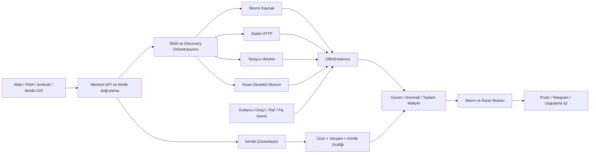

# OmniHunter Bütünleşik Vizyon, Hedefler ve Uygulama Planı

**Hazırlanma tarihi:** 13 Temmuz 2026  
**Değerlendirilen temel:** ShoeHunter AI v0.6.0 çalışma ağacı ve 12 Temmuz 2026 tarihli doğrulanmış yedek  
**Belge türü:** Kod değişikliği içermeyen ürün, güvenlik, verimlilik ve uygulama yol haritası  
**Ana kaynak:** `OMNIHUNTER_GUVENLI_VERI_ERISIMI_VE_MOBIL_HEDEFLER_v2.md`  
**Birlikte değerlendirilen belge:** `SHOEHUNTER_STRATEJIK_HEDEFLER_VE_YOL_HARITASI.md`  
**Destekleyici kanıtlar:** Mevcut kaynak kodu, testler, CI/dağıtım dosyaları, `UYGULAMA_SONUC_RAPORU_v0.6.0.md`, doğrulanmış JSON yedeği ve mobil araştırma notları

## 1. Bu Belgenin Kararı

Asıl `v2` raporun bütün içeriği ürün vizyonuna alınmalıdır. Ancak “bütün içerik kapsamda” demek, bütün özelliklerin aynı anda geliştirilmesi demek değildir. Güvenilirlik, güvenlik ve gerçek müşteri değeri kanıtlanmadan mobil uygulama, OCR, topluluk verisi veya AR katmanına geçmek bugünkü güçlü temeli tekrar kırılgan hale getirir.

Bu nedenle iki rapor birbiriyle çelişmiyor; birbirini tamamlıyor:

- `SHOEHUNTER_STRATEJIK_HEDEFLER_VE_YOL_HARITASI.md`, mevcut ShoeHunter ürününü güvenilir bir **v1.0 çekirdeğine** ulaştıran programdır.
- Asıl `v2` rapor, bu çekirdeğin mağazalara güvenli erişim modelini olgunlaştırır ve ürünü **OmniHunter kişisel alışveriş zekâsına** dönüştürecek uzun vadeli programı tanımlar.
- Doğru sıra: **güvenilir çekirdek -> kanıtlanmış ürün kimliği -> mobil tarama -> karar desteği -> fiziksel mağaza kanıtı -> ürün yaşam döngüsü**.

### Nihai hüküm

ShoeHunter yeniden yazılmamalıdır. Mevcut mimari korunmalı, fakat “scraper sayısı” veya “AI özelliği” üzerinden değil, doğrulanmış satın alma kararları üzerinden ölçülmelidir. OmniHunter’ın gerçek savunulabilir değeri kamerada veya tek başına yapay zekâda değil; fiziksel ürünü doğru varyanta, güvenilir tekliflere, fiyat geçmişine ve sürekli takibe bağlayan **ürün ve kanıt grafiğinde** olacaktır.

## 2. Önceki Değerlendirmenin Düzeltilmesi

Önceki stratejik rapor yanlış belgeyi ana kaynak kabul ettiği için mobil hedefleri v1.0 kapsamının dışında bırakmıştı. Bu karar kısa vadeli geliştirme sırası açısından hâlâ doğrudur, ancak uzun vadeli ürün kapsamı açısından eksiktir.

Yeni karar şudur:

| Konu | Önceki yaklaşım | Güncellenmiş yaklaşım |
| --- | --- | --- |
| Mobil uygulama | v1.0 sonrasına bırak | v1.0 sonrasında uygulanacak kesin program; M0 saha araştırması daha önce başlayabilir |
| Ayakkabı dışı kategoriler | Yalnız pilot | GTIN/ürün kimliği doğruluğu ölçülerek kademeli ana hedef |
| Barkod/QR | Gelecek fikir | OmniHunter’ın birincil veri giriş kapısı |
| OCR ve fotoğraf | Belirsiz sonraki faz | Barkod başarısızlığında kontrollü yedek zincir; M3 hedefi |
| Fiziksel mağaza fiyatı | Kapsam dışı | Kullanıcı onaylı kanıt modeliyle M3-M4 hedefi |
| Toplam fiyat | Mağaza fiyatı ağırlıklı | Kargo, kupon, üyelik ve satıcı riskini içeren karar fiyatı |
| Ürün yaşam döngüsü | Satın alma öncesi | Satın alma öncesi, mağaza içi ve satın alma sonrası tek hafıza |
| Gelir modeli | Ertelenmiş | Güven ve kullanım kapılarından sonra affiliate, premium ve en son B2B |

Mobil program artık “yapılmayacak” değildir; **çekirdek güvenilirlik kapılarından sonra mutlaka yapılacak** ana genişleme programıdır.

## 3. Bugünkü Gerçek Durum

### 3.1 Kodda bulunan güçlü temel

Mevcut sistemde asıl `v2` raporun önemli bir kısmı zaten başlamış durumdadır:

- Alan adı izin listesi, SSRF kontrolleri, yanıt boyutu ve yönlendirme sınırları vardır.
- Açıklayıcı sabit User-Agent, timeout, backoff/jitter ve koşullu HTTP başlıkları kullanılır.
- Statik HTTP ile tarayıcı erişimi ayrılmış; tarayıcı kuyruğu ve mağaza bağlamları oluşturulmuştur.
- Temel circuit breaker, mağaza sağlık verisi ve iş kuyruğu mevcuttur.
- Kimlik doğrulama, CSRF, secret yönetimi, sıkı CORS ve rate limiting temeli vardır.
- Alarm tekilleştirme, cooldown ve kanıt alanları kurulmaya başlanmıştır.
- WatchQuery, aday eşleştirme, discovery, yedekleme, Docker ve CI altyapısı vardır.
- PWA ve yerel ağ kullanımı mevcuttur; bu mobil uygulama değildir ama mobil kullanıcı deneyimi için ilk gözlem alanıdır.

### 3.2 Gerçek verinin gösterdiği olgunluk

12 Temmuz 2026 tarihli doğrulanmış yedek, mimarinin değil gerçek kullanımın fotoğrafıdır:

| Ölçüm | Değer | Ürün kararı |
| --- | ---: | --- |
| Ürün / ilan | 110 / 110 | Her üründe tek ilan; çoklu teklif vaadi henüz gerçek veride oluşmamış |
| Birden fazla ilanı olan ürün | 0 | Ürün merkezli karşılaştırma canlı olarak kanıtlanmamış |
| Temsil edilen mağaza | 12 / 22 | Motor varlığı kapsama eşit değil |
| Intersport yoğunluğu | 71 / 110 (%64,5) | Başarı tek mağazaya fazla bağımlı |
| Fiyat kapsamı | 105 / 110 (%95,5) | Seçilmiş mevcut ürünlerde iyi temel |
| Beden kapsamı | 95 / 110 (%86,4) | Mağazalar arası doğruluk ayrıca ölçülmeli |
| `unknown` stok | 10 / 110 (%9,1) | Belirsizlik doğru tutuluyor; çözüm ve açıklama gerekli |
| Canonical key / identity v2 | 0 / 110 | Yeni kimlik modeline gerçek migrasyon kanıtlanmamış |
| Radar / aday / discovery run | 0 / 0 / 0 | Otonom keşif gerçek kullanımda henüz çalıştırılmamış |
| Store health | 0 | Sağlık sistemi operasyonel geçmiş üretmemiş |
| Fiyat geçmişi | 9.968 | Hacim var, fakat değişiklik temelli yazma geçmişte uygulanmamış |
| Ardışık değişmeyen geçmiş | %97,83 | Depolama ve analiz verimliliği için açık iyileştirme alanı |
| Stok durumu eksik geçmiş | 3.940 / 9.968 (%39,5) | Eski geçmiş doğrudan yüksek güvenli analiz için yeterli değil |
| Alarm kuralı kapsamı | 4 kural, 2 ürün | Takip tabanının çoğu müşteri hedefiyle bağlı değil |

### 3.3 Olgunluk puanı

| Alan | Bugünkü seviye | Hedef |
| --- | ---: | ---: |
| Güvenli mağaza erişimi | 7/10 | 9/10 |
| Veri doğruluğu ve kanıt | 5/10 | 9/10 |
| İş kuyruğu ve operasyon | 6/10 | 9/10 |
| Mağaza kapsamının kanıtı | 4/10 | 8/10 |
| Müşteri yolculuğu | 5/10 | 9/10 |
| Mobil/mağaza içi deneyim | 1/10 | 8/10 |
| Ürün kimliği grafiği | 3/10 | 9/10 |
| Gelir modeline hazırlık | 2/10 | 8/10 |

Bu puanlar kod miktarını değil, gerçek kullanıcıya güvenle sunulabilen davranışı değerlendirir.

## 4. Müşteri Gözüyle Yeniden Değerlendirme

### 4.1 Müşterinin cevap beklediği yedi soru

1. Bu gerçekten aradığım ürün ve tam olarak aynı varyant mı?
2. Benim bedenim veya istediğim seçenek gerçekten stokta mı?
3. Kasada ödeyeceğim toplam tutar nedir?
4. Bu fiyat ne zaman ve hangi kanıtla doğrulandı?
5. Satıcı, teslimat, iade ve garanti güvenilir mi?
6. Şimdi mi almalıyım, yoksa beklemek daha mantıklı mı?
7. Ürün tekrar stoğa girerse veya fiyat düşerse bana zamanında haber verecek mi?

Bugünkü sistem ilk iki soruya kısmen, fiyat ve alarm sorularına güçlü bir başlangıçla cevap veriyor. Toplam maliyet, satıcı güveni, veri tazeliği sunumu, karar açıklaması ve kullanıcı geri bildirimi zayıf kalıyor.

### 4.2 Bugünkü kullanıcı sürtünmeleri

- AI Arama’daki “Takibe Al” ile Ürün Radarı iki ayrı takip modeli gibi davranıyor.
- “En ucuz” fiyat, kargo/kupon/üyelik koşulu ve satıcı riskini içermiyor.
- Ürün kartı fiyatı gösterse de kanıt kaynağı, son doğrulama ve belirsizlik müşteriye yeterince açık değil.
- `blocked`, `unknown`, gerçekten stok dışı ve parser hatası kullanıcı açısından yeterince ayrışmıyor.
- Kullanıcı “bildirim doğruydu/yanlıştı”, “beden vardı/yoktu” geri bildirimi veremiyor.
- Fiziksel mağazada görülen ürün sisteme hızla aktarılamıyor.
- Ayakkabıdan kıyafet ve diğer ürünlere geçerken varyant modeli henüz yeterince genel değil.

### 4.3 Hedef müşteri yolculuğu

```text
Tara veya Ara
  -> Ürünü ve varyantı tanı
  -> Güvenilir teklifleri karşılaştır
  -> Toplam maliyet ve satıcı riskini değerlendir
  -> Şimdi al veya takibe başla
  -> Doğrulanmış bildirimi al
  -> Sonucu onayla
  -> İsterse fiş/raf fiyatıyla sisteme katkı yap
  -> Satın alma sonrası garanti, iade ve fiyat geçmişini sakla
```

Bu akış web, PWA ve gelecekteki mobil uygulamada aynı merkezi API ve aynı ürün kimliği üzerinden çalışmalıdır.

### 4.4 Sonuç kartında zorunlu güven bilgileri

Her teklif müşteriye şu alanlarla sunulmalıdır:

| Alan | Neden gerekli |
| --- | --- |
| Ürün ve varyant eşleşme sınıfı | “Aynı”, “muhtemel”, “inceleme gerekli” ayrımı |
| İstenen beden/seçenek durumu | Genel stok ile kullanıcının ihtiyacını ayırmak |
| Ürün fiyatı ve toplam maliyet | Kargo, kupon ve üyelik koşulunu görünür kılmak |
| Son doğrulama zamanı | Eski veriyi güncel veri gibi göstermemek |
| Kanıt kaynakları | JSON-LD, DOM, resmi API, kullanıcı kanıtı gibi kaynakları açıklamak |
| Güven skoru ve kısa nedeni | Kararın neden güvenilir veya belirsiz olduğunu anlatmak |
| Satıcı ve iade özeti | Pazaryeri tekliflerinde düşük fiyat riskini göstermek |
| Kullanıcı geri bildirimi | Yanlış stok/fiyatı hızla öğrenmek |

## 5. Genişletilmiş Ürün Vizyonu

### 5.1 Yeni ürün tanımı

> OmniHunter, kullanıcının fiziksel veya dijital ortamda karşılaştığı ürünü tanıyan; doğru varyantı güvenilir teklif, toplam maliyet, fiyat geçmişi ve sürekli takiple birleştiren kişisel alışveriş zekâsıdır.

Bu tanım “fiyat karşılaştırma sitesi”nden daha geniş, “her şeyi yapan AI” iddiasından daha ölçülebilirdir.

### 5.2 Ürünün yedi katmanı

1. **Giriş katmanı:** Metin, link, barkod, QR, etiket OCR, fotoğraf ve fiş.
2. **Kimlik katmanı:** CanonicalProduct, ProductVariant ve ProductIdentifier grafiği.
3. **Kanıt katmanı:** Mağaza verisi, resmi kaynak, parser kanıtı, kullanıcı kanıtı ve tazelik.
4. **Karar katmanı:** Toplam maliyet, beden/seçenek, satıcı güveni, teslimat, iade ve fiyat geçmişi.
5. **Takip katmanı:** Hedef fiyat, stok, varyant, fiyat düşüşü ve kişisel bildirim tercihleri.
6. **Öğrenme katmanı:** Kullanıcı onayı, yanlış alarm geri bildirimi ve etiketli eşleşme korpusu.
7. **Yaşam döngüsü katmanı:** Fiş, garanti, iade süresi, fiyat koruması, geri çağırma ve ileride yeniden satış değeri.

### 5.3 “Başka dünyalar” için kontrollü ufuklar

| Ufuk | Ürün değeri | Ön koşul |
| --- | --- | --- |
| Alışveriş hafızası | Kullanıcının takipleri, kararları, bedenleri ve satın alma geçmişi | Güvenli hesap/cihaz modeli |
| Mağaza içi asistan | Tara, online karşılaştır, raftaki fiyatı doğrula | Barkod kimliği ve hızlı API |
| Satın alma sonrası asistan | Fiş, iade tarihi, garanti, fiyat koruması | Açık rıza ve güvenli belge kasası |
| Ev/aile tedarik asistanı | Tekrarlanan ürün, ortak liste ve bütçe | Çoklu kullanıcı ve izin modeli |
| Dijital ürün pasaportu | Kaynak, bakım, geri çağırma, sürdürülebilirlik | GS1 Digital Link/standart veri |
| Yerel fiyat ağı | Kullanıcı onaylı fiziksel mağaza fiyatları | Sahte veri önleme ve kanıt puanı |
| Gizliliği koruyan pazar içgörüsü | Toplu fiyat ve erişilebilirlik analizi | Yeterli ölçek, anonimleştirme ve hukuki değerlendirme |

Bu ufukların hiçbiri çekirdek fırsat doğruluğunu ikinci plana atmayacaktır.

## 6. Ürün İlkeleri

1. **Belirsizliği saklama, göster.** `unknown`, `blocked`, `error` ve `out_of_stock` ayrı durumlardır.
2. **AI önerir, kanıt karar verir.** AI sorgu yapılandırabilir ve görüntüden aday çıkarabilir; ürün kimliği, fiyat ve alarm deterministik kanıtlarla doğrulanır.
3. **Resmi kaynak önce gelir.** API/feed/sitemap varsa normal HTTP ve tarayıcıdan önce kullanılır.
4. **İnsan oturumu açık rızalıdır.** CAPTCHA veya giriş hiçbir zaman gizlice aşılmaz; kullanıcı müdahalesi görünür, süreli ve iptal edilebilir olur.
5. **En ucuz değil, en iyi doğrulanmış karar.** Toplam maliyet, varyant ve satıcı güveni fiyatla birlikte değerlendirilir.
6. **Değişmediyse yazma ve bildirme.** Ağ, depolama ve kullanıcının dikkati korunur.
7. **Mağaza desteği ikili değildir.** Yetenek ve sağlık kanıtına göre Tier ve alan bazında gösterilir.
8. **Gizlilik varsayılandır.** Kamera analizi cihazda başlar; fotoğraf yükleme açık rıza ister.
9. **Gelir sıralamayı bozamaz.** Affiliate ilişkisi görünür olur ve organik sıralama ölçütlerini değiştirmez.
10. **Her faz geri döndürülebilir ve ölçülebilir olmalıdır.** Kabul kapısı geçmeden sonraki maliyetli faz başlamaz.

## 7. Hedef Mimari



### 7.1 Merkezi veri modeli

| Varlık | Sorumluluk | Kritik alanlar |
| --- | --- | --- |
| `CanonicalProduct` | Model ailesi ve ortak ürün kimliği | marka, model, kategori, başlık, açıklama |
| `ProductVariant` | Satılabilir kesin seçenek | renk, beden, cinsiyet/hedef grup, kapasite, paket, üretici kodu |
| `ProductIdentifier` | Ürünü dış dünyaya bağlayan kimlik | GTIN/EAN/UPC, model kodu, SKU, MPN, URL kimliği, kaynak, güven |
| `Offer` | Bir satıcının belirli varyant teklifi | satıcı, fiyat, stok, varyant, URL, tazelik |
| `OfferEvidence` | Bir alanın nasıl bulunduğunu kanıtlar | kaynak türü, ham/normalize değer, zaman, parser sürümü, güven |
| `Seller` | Satıcı güven ve koşulları | pazar yeri, puan, iade, garanti, resmi satıcı durumu |
| `PriceObservation` | Yalnız anlamlı değişiklik geçmişi | fiyat, stok, toplam maliyet, değişiklik nedeni, kanıt özeti |
| `WatchQuery` | Kullanıcı niyeti | ürün/varyant, beden, hedef fiyat, mağaza kapsamı, bildirim |
| `Scan` | Mobil giriş ve çözümleme oturumu | kod türü, değer özeti, sonuç sınıfı, cihazda/online, süre |
| `UserReportedPrice` | Fiziksel fiyat katkısı | mağaza, fiyat, zaman, konum tercihi, kanıt, doğrulama durumu |
| `ReceiptEvidence` | Satın alma kanıtı | isteğe bağlı belge, kalemler, toplam, saklama süresi, rıza |
| `Store` | Mağaza yetenek ve politika kaydı | erişim katmanları, bütçe, Tier, parser sürümü |
| `StoreSession` | İnsan destekli süreli oturum | alan adı, şifreli secret referansı, TTL, son kullanım, iptal |
| `FetchResult` | Her erişim denemesinin sonucu | yöntem, HTTP durumu, blok türü, süre, cache, maliyet |
| `Device` | Mobil cihaz güvenliği | push token, platform, iptal, son görülme |
| `NotificationPreference` | Kanal ve sessizlik tercihleri | push/Telegram, saatler, olay türleri, cooldown |

### 7.2 Kimlik önceliği

```text
Doğrulanmış GTIN/EAN/UPC
  -> marka + üretici model kodu/MPN
  -> mağaza SKU + doğrulanmış varyant
  -> normalize başlık/özellik eşleşmesi
  -> görüntü/OCR/AI adayları
  -> kullanıcı onayı
```

Alt sıradaki yöntem üst sıradaki güçlü kimliği sessizce değiştiremez.

## 8. Güvenli Mağaza Erişimi Programı

### 8.1 Katman sırası

| Katman | Yöntem | Kullanım kararı |
| --- | --- | --- |
| 1 | Resmi API, feed, affiliate API, sitemap veya açık yapılandırılmış veri | Her mağaza için ilk araştırılan yol |
| 2 | Normal HTTP | Varsayılan ve en ucuz erişim |
| 3 | Normal Playwright | JavaScript zorunlu olduğunda kontrollü worker |
| 4 | İnsan destekli erişim | Giriş/CAPTCHA için açık rıza, süreli oturum ve görünür müdahale |
| 5 | Kontrollü başarısızlık | `blocked/unknown`, backoff, circuit breaker; yanlış stok üretme yok |

### 8.2 Kesinlikle uygulanmayacak erişim davranışları

- CAPTCHA çözme servisi veya otomatik CAPTCHA aşma.
- Stealth/evasion eklentisi, tarayıcı parmak izi taklidi veya challenge bypass.
- Çalıntı/üçüncü taraf cookie, oturum veya kimlik bilgisi.
- Kontrolsüz proxy rotasyonu ya da residential proxy ile engel aşma.
- Mağaza limitlerini kırmak için paralel istek saldırısı.
- `blocked` veya parser hatasını stok dışı olarak sunma.

Bu sınırlar sadece hukuki risk için değil; yanlış veriyi ve bakım maliyetini azaltmak için de ürün gereğidir.

### 8.3 Mağaza adaptörü hedef sözleşmesi

Her adaptör şu yetenekleri açıkça bildirmelidir:

- `supports_search`, `supports_product_detail`, `supports_sizes`, `supports_stock`.
- `supports_sitemap`, `supports_jsonld`, `supports_official_api`.
- `requires_browser`, `requires_login`, `supports_human_session`.
- Fiyat türleri: liste, indirim, sepet, kupon, üyelik.
- Son başarılı parser sürümü ve canlı sözleşme tarihi.

Adaptör yalnız veri çıkarmamalı; kanıt ve erişim sonucunu standart biçimde döndürmelidir.

## 9. Verimlilik Programı

### 9.1 Bugünkü açıklar

- ETag/Last-Modified temeli var, fakat cache kalıcı değil ve süreç yeniden başlayınca kayboluyor.
- HTTP istemcisi her erişimde yeniden kuruluyorsa kalıcı bağlantı havuzu ve keep-alive kazancı sınırlanır.
- Tarama sıklığı hedef fiyata yakınlık, geçmiş değişim oranı ve 304 başarısına göre dinamik değil.
- Tarayıcı bağlamlarında açık TTL, iş sayısı limiti ve kontrollü yenileme politikası eksik.
- Circuit breaker ardışık hata temelli; kayan pencere ve hata türü ayrımı yetersiz.
- Geçmiş verinin %97,83’ü ardışık değişmeyen kayıt olduğundan yazma politikası gerçek veride kanıtlanmamış.

### 9.2 Hedef davranış

1. Mağaza/host başına kalıcı HTTP istemcisi ve sınırlandırılmış bağlantı havuzu.
2. ETag, Last-Modified, içerik hash’i ve son başarılı normalize sonucun kalıcı cache’i.
3. Değişmediyse parserın tamamını, geçmiş yazmayı ve alarm değerlendirmesini atlama.
4. Dinamik tarama: hedefe yakın ve sık değişen ürün daha sık; uzun süredir sabit ürün daha seyrek.
5. Öncelik: kullanıcı tetiklemesi > alarm doğrulaması > aktif takip > discovery > bakım.
6. Tarayıcıyı yalnız statik erişim yetersiz olduğunda kullanma.
7. Browser context için maksimum ömür, maksimum iş, bellek sınırı ve sağlık kontrolü.
8. Mağaza başına dakika token bucket, günlük discovery bütçesi ve eşzamanlılık sınırı.
9. 403, 429, CAPTCHA, timeout ve parser hatasını ayrı sayma; aynı backoff uygulanmamalı.
10. Pahalı işlerin maliyetini mağaza, ürün ve kullanıcı akışı bazında ölçme.

### 9.3 Verimlilik hedefleri

| KPI | Hedef | Not |
| --- | ---: | --- |
| Statik/resmi erişim payı | > %70 | Başarılı ayrıntı okumaları içinde |
| Browser gereksinimi | < %25 | Mağaza bazında ayrıca izlenir |
| İnsan destekli erişim | < %5 | Normal çalışma yöntemi olmamalı |
| Değişmeyen gözlem yazımı | < %5 | Sağlık/audit istisnaları hariç |
| Süresi geçmiş `running` iş | 0 | İki lease süresinden uzun |
| Zamanı gelen iş tamamlama | >= %99/24 saat | Retry sonunda |
| Mağaza bütçe aşımı | 0 | Her aşım hata sayılır |
| Cache/304 kazanımı | Önce baz ölçüm, sonra mağaza hedefi | Tek sayı mağazalar arası yanıltıcı olabilir |

## 10. Veri Kalitesi ve Alarm Güveni

### 10.1 Çok kaynaklı kanıt

Parser fallback zinciri ile çok kaynaklı doğrulama aynı şey değildir. Hedef sistem, fiyat ve stok için JSON-LD, meta, DOM, resmi API ve varyant yanıtlarını ayrı `OfferEvidence` kayıtları olarak saklayıp karşılaştırmalıdır.

Örnek karar:

```text
Resmi API fiyatı = 3.999 TL
JSON-LD fiyatı   = 3.999 TL
DOM fiyatı       = 2.199 TL (üyelik/kupon etiketi belirsiz)

Sonuç: 3.999 TL doğrulanmış fiyat; 2.199 TL koşullu aday fiyat.
Alarm: Koşul çözülmeden kesin fiyat düşüşü alarmı yok.
```

### 10.2 Anomali karantinası

Şu olaylar ikinci doğrulama veya inceleme gerektirir:

- Tek kontrolde olağan dışı %80-%90 fiyat düşüşü.
- Fiyatın varyant seçimiyle açıklanamayan şekilde değişmesi.
- Stok bilgisinin fiyat ve satın alma butonuyla çelişmesi.
- Para birimi, ondalık veya binlik ayırıcı şüphesi.
- Aynı ürünün mağaza içi ve online fiyatı arasında açıklanamayan uçurum.
- Yeni parser sürümünden sonra toplu alan kaybı.

Karantinadaki veri kullanıcı alarmına dönüşmez; yönetim panelinde görünür.

### 10.3 Alarm karar sırası

1. Kimlik ve varyant güveni yeterli mi?
2. İstenen beden/seçenek doğrulandı mı?
3. Fiyat türü ve toplam maliyet anlaşıldı mı?
4. Veri yeterince taze mi?
5. Anomali veya kaynak çelişkisi var mı?
6. Cooldown/dedup kuralı uygun mu?
7. Gönderimden hemen önce kritik alanlar yeniden doğrulandı mı?

Bu sıranın herhangi bir kritik adımı başarısızsa bildirim yerine `unknown`, `review` veya sessiz yeniden deneme üretilir.

## 11. Güvenlik Programı

### 11.1 Mevcut güçlü alanlar

- SSRF ve alan adı izin listesi.
- Secret yönetimi ve gizli değerlerin Git’ten ayrılması.
- Auth, CSRF, CORS ve temel rate limit.
- Yanıt boyutu, yönlendirme ve timeout sınırları.
- Yedekleme/geri yükleme araçları ve CI secret taraması.

### 11.2 Kalan öncelikli güvenlik hedefleri

| Risk | Hedef kontrol | Kabul ölçütü |
| --- | --- | --- |
| Riskli scraping bağımlılığı | Yasak paket/anahtar kelime politikası ve CI kontrolü | Yasak bağımlılık birleşemez |
| Açılış migrasyonu başarısızlığı | Kritik DB/index hatasında readiness kapalı | Sistem yanlışlıkla hazır görünmez |
| İnsan destekli cookie | Alan adına bağlı, şifreli, süreli, iptal edilebilir secret referansı | API/log/yedekte ham cookie yok |
| QR kötü niyetli URL | Hiçbir QR otomatik açılmaz; aynı URL güvenlik hattından geçer | Kullanıcı onayı olmadan navigasyon yok |
| Mobil token hırsızlığı | OS keystore, kısa ömürlü access token, cihaz iptali | Kayıp cihaz tek başına iptal edilebilir |
| Fotoğraf/fiş gizliliği | Cihazda işleme varsayılanı, açık rıza, saklama süresi | Rızasız yükleme ve süresiz saklama yok |
| Yetki büyümesi | Yönetici, kullanıcı, worker ve cihaz kapsamları ayrılır | En az yetki testleri geçer |
| Yedek sızıntısı | Şifreleme, erişim kısıtı ve geri yükleme denetimi | Secret/kişisel veri envanteri doğrulanır |
| Bağımlılık zafiyeti | Python/npm/container taraması ve güncelleme politikası | Kritik açık yayın kapısıdır |

### 11.3 İnsan destekli erişim için özel karar

İlk tercih merkezi sunucuda kullanıcı mağaza oturumları saklamak değildir. Önce yerel companion/cihaz oturumu veya mağazanın resmi entegrasyonu değerlendirilmelidir. Merkezi `StoreSession` ancak açık müşteri değeri, hukuki uygunluk ve şu kontrollerle açılmalıdır:

- Açık rıza ve hangi mağazada ne amaçla kullanılacağının gösterimi.
- Domain-bound cookie allowlist; parola saklamama.
- Şifreli secret store ve kısa TTL.
- Tek tıkla iptal, cihaz/oturum geçmişi ve son kullanım zamanı.
- Login/CAPTCHA adımında otomasyonun durması ve kullanıcının devralması.
- Arka planda sınırsız veya gizli kullanımın engellenmesi.

## 12. Operasyon ve Yönetim Paneli

Yönetim paneli yalnız “mağaza çalışıyor/çalışmıyor” göstermemelidir. Dört ayrı operasyon alanı olmalıdır:

| Alan | Görülecekler | Yapılabilecekler |
| --- | --- | --- |
| Mağaza sağlığı | başarı, 403/429/CAPTCHA, parser, beden/fiyat oranı, browser payı | circuit aç/kapat, bütçe değiştir, test URL çalıştır |
| İnsan müdahalesi | bekleyen giriş/CAPTCHA, oturum TTL, son kullanım | devral, iptal et, oturumu sil |
| Veri kalitesi | kaynak çelişkisi, anomali, düşük güven, yeni parser etkisi | kanıtı incele, doğrula/reddet, yeniden tara |
| Görev kuyruğu | pending/running/retry/dead, yaş, lease, maliyet | kontrollü replay, iptal, öncelik ayarı |

Ek olarak her kararın kim/neyin tarafından verildiği, parser sürümü ve korelasyon kimliği audit kaydında tutulmalıdır.

## 13. Mobil OmniHunter Kararı

### 13.1 Kesin ürün kararı

Mobil uygulama yapılmalıdır. Ancak ilk sürüm “web sitesinin telefondaki kopyası” olmayacaktır. Telefonun özgün rolü şunlardır:

- Barkod/QR ile ürünü mağazada anında sisteme almak.
- Cihaz üzerinde kod ve gerektiğinde etiket metni çözmek.
- Teklifleri merkezi API’den almak ve tek dokunuşla takibe başlamak.
- Push bildirimi almak.
- İsteğe bağlı raf fiyatı/fiş kanıtı toplamak.

### 13.2 Teknik çerçeve kararı neden hemen kilitlenmemeli

Asıl rapor React Native’i öneriyor. Bu makul bir adaydır; fakat mevcut React web bileşenleri native ekranda doğrudan yeniden kullanılamaz. Kamera, ML Kit, offline kuyruk, push ve güvenli depolama platforma özgü entegrasyon ister. Bu nedenle karar iki haftalık dikey dilimden sonra verilmelidir.

Karşılaştırılacak iki prototip:

| Aday | Dikey dilim | Güçlü taraf | Risk |
| --- | --- | --- | --- |
| React Native + native barkod modülü | Tara -> API -> teklif -> takip -> push | Ürün ekranlarında ortak ekip/TypeScript yaklaşımı | Native köprü ve kamera bağımlılığı bakım maliyeti |
| Kotlin + CameraX + ML Kit | Aynı uçtan uca akış | Android-first kamera ve performans kontrolü | iOS için ayrı istemci gerekebilir |

Karar ölçütleri:

- Düşük ışıkta ve farklı cihazlarda okuma başarısı.
- p50/p95 tarama gecikmesi ve ilk açılış süresi.
- Offline davranış ve model hazır olma garantisi.
- Crash-free oturum, uygulama boyutu ve pil kullanımı.
- Native kod miktarı ve altı aylık bakım maliyeti.
- Erişilebilirlik ve test otomasyonu.

Google’ın resmi dokümanına göre ML Kit, EAN/UPC/Code 128/QR/Data Matrix dahil yaygın 1D/2D biçimleri destekler; özel arayüz gereken kullanımda tam Barcode Scanning API önerilir. Hızlı doğrulama prototipinde izinsiz Google Code Scanner kullanılabilir, fakat markalı gerçek tarama ekranında CameraX + ML Kit daha kontrollü adaydır.

### 13.3 Mobil MVP

MVP yalnız şu akışı kanıtlar:

```text
EAN/UPC/GTIN/QR tara
  -> cihazda kodu çöz
  -> merkezi kimlik API’sine gönder
  -> aynı / muhtemel / bulunamadı sonucunu göster
  -> güvenilir online teklifleri getir
  -> toplam fiyatın bilinen kısmını göster
  -> kullanıcı onayıyla takibe başla
  -> push + Telegram tercihi sun
```

MVP dışı ama kapsamda kalan işler: fotoğrafla tanıma, raf OCR, fiş ayrıştırma, konum önerisi, AR ve sanal deneme.

### 13.4 Offline ve gizlilik davranışı

- Barkod çözme ve format doğrulama cihazda çalışır.
- Son başarılı sınırlı ürün kimliği cache’i cihazda şifreli tutulabilir.
- İnternet yoksa tarama, zaman ve kod özeti offline kuyruğa alınır; fiyat “güncel” gösterilmez.
- Bağlantı gelince idempotent `scan_id` ile çözümleme sürdürülür.
- Kamera karesi varsayılan olarak sunucuya gönderilmez.
- OCR/fotoğraf yükleme ayrı rıza, amaç ve saklama süresi ister.
- QR içeriği otomatik açılmaz; URL allowlist/SSRF/güvenlik hattına gönderilir.

### 13.5 GS1 ve 2D gelecek hazırlığı

GS1’in perakendede 2D barkoda geçiş rehberi; GTIN yanında lot, seri ve son kullanma gibi alanların aynı kodda taşınabileceği bir geleceğe işaret eder. Bu nedenle `ProductIdentifier`, yalnız EAN metni değil; şema, application identifier, issuer, lot/seri ve çözümleme kaynağını taşıyabilecek biçimde tasarlanmalıdır. M5’e kadar tam GS1 entegrasyonu şart değildir, fakat veri modeli bugün çıkmaz sokağa girmemelidir.

## 14. Gelir Modeli ve Güven Sırası

### 14.1 Gelir katmanları

| Sıra | Model | Ne zaman açılır | Koruma kuralı |
| --- | --- | --- | --- |
| 1 | Affiliate | Doğrulanmış teklif ve açıklanmış ilişki sonrası | Sıralamayı ve güven skorunu değiştiremez |
| 2 | Premium bireysel | Kullanıcı düzenli ve ölçülen değer aldıktan sonra | Temel doğruluk ücretsiz kullanıcıda düşürülemez |
| 3 | Aile/ev planı | Çoklu kullanıcı ve izin modeli olgunlaştığında | Özel alışveriş verisi üyeler arasında açık izinle paylaşılır |
| 4 | B2B toplu analiz | Ölçek, anonimlik ve hukuki inceleme sonrası | Bireysel kullanıcı/fiş verisi satılmaz |

### 14.2 Premium için olası gerçek değerler

- Daha fazla aktif takip ve daha kısa kontrol aralığı.
- Beden/varyant odaklı gelişmiş alarm.
- Fiyat geçmişi ve satın alma zamanı içgörüsü.
- Aile listeleri ve ortak bütçe.
- Fiş, garanti ve iade tarihi kasası.
- Gelişmiş satıcı ve toplam maliyet karşılaştırması.

“AI var” tek başına ücretli özellik gerekçesi değildir; ölçülen tasarruf, zaman kazanımı ve güvenilirliktir.

## 15. Ana KPI Sistemi

### 15.1 Kuzey yıldızı

**Doğrulanmış Faydalı Karar (DFK):** Kullanıcının doğru ürün/varyant için gördüğü veya aldığı fırsatın sonradan “doğru fiyat, doğru stok ve işe yarar karar” olarak onaylanması.

Bu metrik tıklamadan daha değerlidir. Affiliate tıklaması büyürken DFK düşüyorsa ürün yanlış yöndedir.

### 15.2 Çekirdek güven KPI’ları

| KPI | İlk hedef |
| --- | ---: |
| Doğrulanmış fırsat doğruluğu | >= %95 |
| Yanlış stok alarmı | < %1 |
| Otomatik eşleşme precision | >= %99 |
| Tier 1 ürün detay başarısı | >= %98 |
| Beden destekleyen Tier 1 doğruluğu | >= %95 |
| Tier 1 bilinen teklif keşfi | >= %90 / 24 saat |
| Kritik belirsizliğin kesin sonuç gibi sunulması | 0 |

### 15.3 Mobil KPI’lar

M0 ve M1 eşikleri saha baz ölçümünden sonra kesinleştirilir; başlangıç hedefleri:

| KPI | Hedef |
| --- | ---: |
| Desteklenen okunabilir kodda tarama başarısı | > %95 |
| Cihaz içi decode p95 | < 1 saniye |
| Cache sonucu p95 | < 2 saniye |
| Online ilk aday sonucu p95 | < 8 saniye |
| Crash-free oturum | > %99,5 |
| Offline kuyruk senkron başarısı | > %99 |
| Güçlü kategorilerde kesin/kuvvetli ürün çözümü | >= %85 |
| Genel M0 örnekleminde kullanılabilir aday | >= %70 |
| Scan -> karşılaştırma tamamlama | Baz ölçüm sonrası hedef |
| Scan -> takip dönüşümü | Baz ölçüm sonrası hedef |

### 15.4 İş ve müşteri koruma metrikleri

- Kullanıcı tarafından yanlış işaretlenen alarm oranı.
- Bildirim teslim, açılma ve mağazaya geçiş oranı.
- Kullanıcı başına doğrulanmış tasarruf; yalnız kullanıcı onaylı olaylardan hesaplanır.
- Takip oluşturma süresi ve terk noktaları.
- “Sonuç yok” neden dağılımı: kimlik yok, teklif yok, blok, zaman aşımı, düşük güven.
- Affiliate sıralama sapması: sıfır.
- Fotoğraf/fiş rıza geri çekme ve silme SLA’sı.

## 16. Bütünleşik Yol Haritası

### Faz F0 - v0.6.1: Temiz Baz ve Gerçek Veri Migrasyonu

**Amaç:** Kaynak kodu, Git sürümünü ve gerçek Mongo verisini aynı gerçekle buluşturmak.

**Ana işler:**

- Temiz sürüm tabanı ve secret/geçici dosya denetimi.
- 110 ürünün canonical identity migrasyonu.
- Orphan, duplicate ve kimlik çakışma raporu.
- Eski fiyat geçmişinin ham arşiv + aktif sıkıştırılmış geçmiş ayrımı.
- Yedek alma ve ayrı veritabanına geri yükleme provası.

**Gate F0:** Veri kaybı yok; canonical kapsam %100 veya açıklanmış istisna; orphan sıfır; geri yükleme başarılı.

### Faz F1 - v0.6.2: Worker Toparlanması ve Gözlemlenebilirlik

**Amaç:** Worker, browser veya Mongo kesintisinde işlerin sessizce takılmaması.

**Ana işler:**

- Süresi dolmuş `running` job reaper ve heartbeat.
- Dead-letter inceleme/replay.
- Kritik startup migration/index hatasında readiness başarısızlığı.
- Queue yaşı, lease, retry ve maliyet görünürlüğü.
- Worker öldürme ve 24 saat soak testi.

**Gate F1:** İki lease süresinden uzun running iş yok; iş kaybı ve yinelenen alarm yok; 24 saat test geçer.

### Faz F2 - v0.7.0: Tier 1 Mağaza ve Kanıt Güveni

**Amaç:** “22 motor var” yerine hangi alanın hangi mağazada güvenilir olduğunu kanıtlamak.

**Öncelikli mağazalar:** Intersport, Adidas TR, Decathlon, Sportive, Yalı Spor, Amazon TR, Nike TR, Puma TR, New Balance TR.

**Ana işler:**

- Mağaza başına stokta, stok dışı/belirsiz, indirimli/varyantlı fixture ve canlı kontrat örnekleri.
- `OfferEvidence`, kaynak çelişkisi ve anomali karantinası.
- Tam mağaza sağlık metrikleri ve Tier terfi/düşürme kuralı.
- Resmi API/feed/sitemap envanteri.
- Riskli dependency/pattern CI politikası.

**Gate F2:** Ürün/fiyat başarı >= %98; beden doğruluğu >= %95; yanlış stok < %1; 14 günlük sağlık kanıtı.

### Faz F3 - v0.8.0: Verimli ve Doğrulanmış Otonom Discovery

**Amaç:** Radarın yeni ilanı bulup doğru ürüne bağladığını gerçek veride kanıtlamak.

**Ana işler:**

- 100 sorgu / en az 500 aday etiketli korpus.
- Otomatik/review/reject eşik ölçümü.
- Kalıcı cache, dinamik tarama ve mağaza bütçeleri.
- En az beş canlı radar ve yedi günlük çalışma.
- En az üç canonical üründe çoklu mağaza teklifi.

**Gate F3:** Auto precision >= %99; bilinen teklif keşfi >= %90/24 saat; doğrulanmamış aday otomatik bağlı sayılmaz.

### Faz F4 - v0.9.0: Birleşik Müşteri Deneyimi

**Amaç:** AI Arama, link ekleme, Ürünler ve Radar’ı tek satın alma yolculuğu yapmak.

**Ana işler:**

- “Takibe Al” işlemini canonical ürün/radar akışına bağlama.
- Ürün kartında teklif, varyant, toplam maliyet, tazelik ve kanıt.
- Global alarm ile kişisel hedef alarmını ayırma.
- Yanlış fiyat/stok geri bildirimi.
- Mobil PWA E2E akışları.

**Gate F4:** Yeni kullanıcı tek akıştan radar kurar; aynı ürün çift takip modeline düşmez; ana akış E2E geçer.

### Faz F5 - v1.0.0: Güvenilir Ev Sunucusu Sürümü

**Amaç:** Yerel ağda ve seçilen sunucuda günlük kullanım için güvenli işletim.

**Ana işler:**

- HTTPS/reverse proxy, doğru CORS ve secret kurulumu.
- Docker build/health/readiness ve kurulum provası.
- Günlük yedek, aylık restore, izleme ve runbook.
- Yedi gün soak, ardından 30 gün güvenilir kullanım gözlemi.

**Gate F5:** Kritik güvenlik bulgusu yok; günlük yedek %100; 30 gün içinde kayıp iş/veri ve tekrarlanan yanlış alarm yok.

### Faz M0: Saha Doğrulama ve Mobil Dikey Dilim

**Ne zaman:** F2 verisi oluşurken araştırma başlayabilir; ürün geliştirme kararı F3/F4 göstergeleriyle verilir.

**Ana işler:**

- Farklı mağaza ve kategorilerden 100-500 gerçek barkod örneklemi.
- GTIN -> canonical ürün -> teklif çözüm oranı ölçümü.
- React Native ve Kotlin adaylarında aynı dikey dilim.
- Kullanıcıyla mağaza içinde tarama, sonuç ve takip testi.
- Barkodsuz, mağaza içi SKU, QR URL ve GS1 DataMatrix örneklerinin sınıflandırılması.

**Gate M0:** Genel kullanılabilir aday >= %70; güçlü kategoriler >= %85; teknoloji kararı ölçümle verilir; müşteri taramadan takibe akışı anlayabilir.

### Faz M1: Android Barkod MVP

**Ana işler:**

- EAN-13/8, UPC-A/E, Code 128, QR ve gerekli Data Matrix desteği.
- Cihaz içi tarama, offline kuyruk, kimlik API’si.
- Aynı/muhtemel/bulunamadı sonuç sınıfları ve kullanıcı onayı.
- Teklif, takip, push ve Telegram tercihleri.
- OS güvenli depolama, cihaz iptali ve mobil telemetry.

**Gate M1:** Tarama > %95; p95 decode < 1 sn; crash-free > %99,5; offline sync > %99; güvenlik ve saha beta kapısı geçer.

### Faz M2: Çok Kategorili Kimlik, Toplam Maliyet ve Satıcı Güveni

**Ana işler:**

- Kategori şemaları ve `ProductVariant` genişlemesi.
- Seller modeli, iade/garanti/teslimat sinyalleri.
- Kargo, kupon ve üyelik koşullu toplam maliyet.
- Kategori başına etiketli kimlik korpusu ve eşik.

**Gate M2:** Her açılan kategoride tanımlı altın veri seti, kabul edilen precision ve müşteri karar kartı doğruluğu.

### Faz M3: OCR, Fotoğraf ve Fiziksel Fiyat Kanıtı

**Ana işler:**

- Etiket OCR: marka, model kodu, beden, fiyat.
- Çoklu sinyal: barkod + OCR + fotoğraf + mağaza bağlamı.
- Manuel raf fiyatı, etiket fotoğrafı ve fiş tarama.
- Görsel yükleme rızası, saklama süresi ve silme.

**Gate M3:** OCR, barkod bulunamadı akışında ölçülebilir ek çözüm sağlar; yanlış kesin eşleşmeyi artırmaz; gizlilik testi geçer.

### Faz M4: Doğrulanmış Mağaza İçi Ağ

**Ana işler:**

- Kullanıcı katkısı güven skoru, tekrar ve sahte veri önleme.
- Zaman/mağaza/ürün/varyant bağlı fiziksel fiyat.
- Kanıt birleşimi ve moderasyon kuyruğu.
- Yerel mağaza stok/fiyat tazelik modeli.

**Gate M4:** Yeterli katkı yoğunluğu, düşük sahte veri oranı, kullanıcıya açık kaynak/tazelik ve sürdürülebilir moderasyon maliyeti.

### Faz M5: GS1 Digital Link ve Ürün Yaşam Döngüsü

**Ana işler:**

- GS1 Digital Link çözümleme, lot/seri/son kullanma alanları.
- Dijital ürün pasaportu, garanti, geri çağırma ve bakım bağları.
- Uygun resmi doğrulama servisleri ve kullanım limitleri.

**Gate M5:** Standart uyumluluk testleri, hukuki değerlendirme ve gerçek üretici verisiyle pilot.

### Faz M6: AR ve İleri Mağaza Deneyimi

**Ana işler:**

- Kamera üstü güvenilir fiyat kartı.
- Raf üzerindeki birden fazla ürünün yönlendirilmiş taraması.
- Yalnız kategori değeri kanıtlanırsa sanal deneme.

**Gate M6:** M1-M4 kullanım verisi AR’ın gerçek görev süresini azalttığını gösterir; erişilebilirlik, pil ve mahremiyet sınırları geçer.

## 17. 30/60/90 Günlük Uygulama Programı

Bu program tek geliştirici/kurucu temposuna göre hazırlanmıştır. Mobil kodlama, çekirdek verinin kanıtından önce başlamaz; saha araştırması başlayabilir.

### İlk 30 gün

- F0 veri migrasyonu, yedek/restore ve temiz sürüm kapısı.
- F1 lease recovery, readiness, kuyruk görünürlüğü ve 24 saat soak.
- Tier 1 için kontrollü URL/fixture matrisi.
- Kuzey yıldızı ve güven KPI olay sözlüğü.
- M0 için kategori/barkod örneklem planı ve kullanıcı görüşme senaryosu.
- Yasak erişim yöntemleri ve StoreSession güvenlik politikası yazılı kabulü.

**Çıktı:** Güvenilir geliştirme tabanı, gerçek baz metrik ve izlenebilir backlog.

### 31-60 gün

- F2 mağaza kontratları, kanıt modeli, anomali karantinası ve sağlık paneli tasarımı.
- Resmi kaynak/sitemap envanteri ve mağaza Tier kararları.
- Kalıcı HTTP/cache ve dinamik tarama için ölçüm tabanı.
- 100-500 barkodun saha toplanması; ilk GTIN çözüm raporu.
- React Native/Kotlin dikey dilim teknik tasarımı, henüz ürünleştirme yok.

**Çıktı:** Hangi mağazanın hangi alanına güvenileceği ve mobil kimliğin gerçek çözüm oranı bilinir.

### 61-90 gün

- F3 canlı Radar, eşleşme korpusu ve yedi günlük discovery testi.
- F4 birleşik takip yolculuğu ve müşteri güven kartı tasarımı.
- Toplam maliyet/satıcı güveni için veri kullanılabilirlik deneyi.
- M0 dikey dilim ve gerçek cihaz/mağaza saha testi.
- M1 go/no-go, teknik çerçeve ve gerçek süre/bütçe kararı.

**Çıktı:** Mobil MVP’ye sezgiyle değil, ölçülmüş kimlik ve çekirdek güven verisiyle girilir.

## 18. Kaynak ve Süre Tahmini

Tahminler F0-F5’in büyük ölçüde tamamlandığı varsayımına dayanır:

| Ekip | M0 + M1 tahmini | Not |
| --- | --- | --- |
| 1 mobil + 1 backend + yarı zamanlı QA/DevOps | 10-14 hafta | Sağlam Android MVP |
| Tek geliştirici | 16-24 hafta | Kapsam disiplinine çok bağlı |
| 2 geliştirici + ürün/UX + QA | 8-10 hafta | Daha hızlı beta ve saha iterasyonu |

Asıl maliyet kamera ekranı değildir. Ürün kimliği, mağaza erişimi, kanıt, varyant, toplam maliyet ve yanlış alarm önleme maliyet merkezidir.

## 19. Faz Geçiş Kuralları

1. Bir faz “kod tamamlandı” diye değil, kabul metriği gerçek veride geçtiğinde biter.
2. Güvenlik veya veri kaybı bulgusu varsa özellik fazı durur.
3. Her yeni kategori altın veri seti ve varyant şeması olmadan açılmaz.
4. Düşük güvenli sonuç kapsam sayısına eklenmez.
5. Mobil uygulama, web çekirdeğinin farklı doğruluk kurallarını üretmez; aynı merkezi karar sözleşmesini kullanır.
6. İnsan destekli oturum kullanımı %5’i geçerse erişim stratejisi tekrar tasarlanır.
7. AR, fotoğraf veya topluluk verisi temel tarama ve kimlik başarısını düşürürse geri alınır.
8. Gelir deneyi DFK veya yanlış alarm koruma metriğini bozarsa durdurulur.

## 20. Risk Kayıtları

| Risk | Olasılık / Etki | Erken sinyal | Karşılık |
| --- | --- | --- | --- |
| Mağaza anti-bot değişimi | Yüksek / Yüksek | 403/429/CAPTCHA artışı | Katmanlı erişim, circuit, resmi kaynak, kontrollü bilinmez |
| Yanlış ürün/varyant | Orta / Çok yüksek | Kullanıcı redleri, model kodu çelişkisi | GTIN-first, kanıt grafiği, review, yüksek auto precision |
| Yanlış fiyat/stock alarmı | Orta / Çok yüksek | Aşırı fiyat düşüşü, kaynak ayrışması | Anomali karantinası, ikinci kontrol, tazelik |
| Tek mağazaya bağımlılık | Yüksek / Yüksek | Intersport payının düşmemesi | Tier 1 kontrat programı ve discovery kapsamı |
| Mobil çerçeve kilitlenmesi | Orta / Orta | Fazla native workaround | İki haftalık eşdeğer dikey dilim |
| Barkod ürün eşleşmemesi | Orta / Yüksek | M0 çözüm oranı < %70 | Kategori daraltma, kimlik ortaklıkları, OCR yedeği |
| Toplulukta sahte fiyat | Orta / Yüksek | Uç değer ve tekrar örüntüsü | Kanıt puanı, moderasyon, kullanıcı itibarı, TTL |
| Fotoğraf/fiş mahremiyeti | Orta / Çok yüksek | Gereksiz saklama ve belirsiz rıza | Cihazda işleme, minimizasyon, süreli saklama, silme |
| Operasyon maliyeti | Orta / Yüksek | Browser payı ve kuyruk yaşı artışı | Bütçe, cache, dinamik tarama, Tier düşürme |
| Gelir-güven çatışması | Orta / Çok yüksek | Sponsorlu düşük kalite teklif yükselişi | Açıklama, sıralama bağımsızlığı, audit |
| Ürün kapsamının dağılması | Yüksek / Yüksek | Çok özellik, düşük DFK | Faz kapıları ve “şimdi değil” listesi |

## 21. Şimdi Değil, Sonra Kesinlikle

Asıl raporun hiçbir meşru hedefi iptal edilmiyor. Aşağıdakiler sıralama nedeniyle erteleniyor:

- M1 doğrulanmadan iOS eşit kapsam.
- Barkod ve kimlik çözümü kanıtlanmadan fotoğrafla genel ürün tanıma.
- Yeterli fiziksel katkı olmadan yerel mağaza fiyat haritası.
- Kullanım verisi olmadan AR fiyat kartı veya sanal deneme.
- Güven/ölçek/hukuk kapısı olmadan B2B veri ürünü.
- Güçlü ürün kimliği olmadan tüm kategorileri aynı anda açma.
- Resmi veya normal erişim yolları tükenmeden insan oturumu toplama.

“Şimdi değil” bir ret değildir; sonraki fazın başarısını koruyan sıradır.

## 22. Asıl Rapor İçin 45 Maddelik İzlenebilirlik

Durumlar: **Var** = temel mevcut; **Kısmi** = önemli parça var ama rapor hedefi tamamlanmamış; **Yok** = henüz ürün/kod/veri kanıtı yok; **Plan** = politika/gelecek kararı.

### 22.1 Güvenli erişim ve backend: 1-22

| No | Rapor başlığı | Bugünkü durum | Hedef faz | Ana kabul |
| ---: | --- | --- | --- | --- |
| 1 | Ana hedef | Kısmi | F0-F5 | Güvenilir ürün/stok/fiyat, kontrollü maliyet |
| 2 | Temel politika | Kısmi | F0-F2 | Politika CI, panel ve runbook ile uygulanır |
| 3 | Kullanılabilecek/kullanılmayacak yöntemler | Kısmi | F0-F2 | Resmi kaynak envanteri; yasak yöntem kontrolü; insan akışı açık |
| 4 | Riskli bağımlılıklar | Kısmi | F0 | Paket/anahtar kelime CI kapısı; gitleaks’e ek kontrol |
| 5 | Katmanlı mağaza erişimi | Kısmi | F2-F3 | Resmi -> HTTP -> browser -> insan -> kontrollü hata ölçülür |
| 6 | Standart adaptör arayüzü | Kısmi | F2 | Stok/login/sitemap/JSON-LD/API ve kanıt yetenekleri tam |
| 7 | Veri kalitesi | Kısmi | F2 | Çok kaynaklı evidence, güven skoru, anomali karantinası |
| 8 | Değişiklik temelli tarama | Kısmi | F0-F3 | Değişmeyen geçmiş yazımı < %5; dinamik program |
| 9 | Önbellek ve ağ verimliliği | Kısmi | F3 | Kalıcı ETag/hash/cache ve connection pool |
| 10 | Tarayıcı verimliliği | Kısmi | F1-F3 | Context TTL/iş sınırı; browser payı < %25 |
| 11 | Circuit breaker | Kısmi | F2 | Kayan pencere, hata türü, half-open probe, görünür durum |
| 12 | Mağaza sağlık metrikleri | Kısmi | F2 | 403/429/CAPTCHA/size/browser/parser metrikleri ve 14 gün veri |
| 13 | Veri modeli | Kısmi | F0-F2 | Store, StoreSession, FetchResult, OfferEvidence sözleşmeleri |
| 14 | Güvenlik gereksinimleri | Kısmi/Güçlü | F0-F5 | Readiness, session, dependency, backup ve mobil güvenlik kapıları |
| 15 | Rate limiting ve görev bütçesi | Kısmi | F2-F3 | Mağaza token bucket, günlük discovery bütçesi, aşım sıfır |
| 16 | Scheduler/worker mimarisi | Kısmi | F1-F3 | Lease recovery, heartbeat, öncelik, DLQ, soak |
| 17 | Alarm kalitesi | Kısmi/Güçlü | F2-F4 | Kimlik + varyant + toplam maliyet + tazelik + ikinci doğrulama |
| 18 | Yönetim paneli | Kısmi | F1-F3 | Sağlık, müdahale, kalite ve kuyruk için dört operasyon alanı |
| 19 | Test stratejisi | Kısmi | F0-F5 | Birim, entegrasyon, mağaza kontratı, worker, E2E, restore |
| 20 | Uygulama sırası | Plan/Kabul | Tüm fazlar | Bu belgedeki F0-F5 sırası ve kapıları |
| 21 | Başarı ölçütleri | Kısmi | F1-F4 | KPI olayları, dashboard, baz ve gerçek veri hedefleri |
| 22 | Son karar | Plan/Kabul | Sürekli | Etik katmanlı erişim ve kontrollü başarısızlık ana politika |

### 22.2 OmniHunter mobil hedefleri: 23-45

| No | Rapor başlığı | Bugünkü durum | Hedef faz | Ana kabul |
| ---: | --- | --- | --- | --- |
| 23 | OmniHunter mobil vizyonu | Plan | M0-M6 | Mobil, ürün kimliğinin fiziksel giriş kapısı olur |
| 24 | Uygulanabilirlik/pazar | Plan | M0 | 100-500 saha örneği ve kullanıcı testiyle doğrulama |
| 25 | Mobilin sistemdeki rolü | Yok | M1 | İnce istemci, merkezi API ve ortak karar sözleşmesi |
| 26 | Barkod ve QR | Yok | M1 | Desteklenen kodlar, offline kuyruk ve güvenli QR |
| 27 | Ürün kimliği | Kısmi | F0, M0-M2 | Canonical + Variant + Identifier grafiği ve altın veri seti |
| 28 | Barkoddan ürün bulma | Yok | M0-M1 | Cache -> kimlik -> teklif -> sınıf -> kullanıcı onayı |
| 29 | OCR/fotoğraf yedeği | Yok | M3 | Çoklu sinyal ek değer sağlar, yanlış kesinlik artırmaz |
| 30 | Mağaza içi UX | Yok | M0-M1 | Tarama -> sonuç -> takip görevi saha testinde anlaşılır |
| 31 | Fiziksel mağaza fiyatı | Yok | M3-M4 | Manuel/OCR/fiş kanıtı, TTL ve doğrulama |
| 32 | En uygun fiyat hesabı | Yok/Kısmi | F4, M2 | Kargo, kupon, üyelik, satıcı ve tazelik dahil |
| 33 | Satıcı güven modeli | Yok | M2 | Açıklanabilir seller skoru ve pazar yeri ayrımı |
| 34 | Mobil teknik mimari | Plan/Güncellendi | M0 | RN ile Kotlin eşdeğer dikey dilim sonrası karar |
| 35 | Mobil API’ler | Yok | M0-M1 | Versiyonlu scan/resolve/offers/watch/device API’leri |
| 36 | Push bildirim | Yok | M1 | FCM/APNs, cihaz iptali, dedup ve teslim metriği |
| 37 | Mobil gizlilik/güvenlik | Yok | M0-M1 | Cihazda işleme, rıza, keystore, silme, QR güvenliği |
| 38 | GS1 Digital Link/2D | Yok/Plan | M5; model M0 | Şema hazır, standart pilot ve resmi veri |
| 39 | AR | Plan/Ertele | M6 | Önceki faz verisi değer ve performansı kanıtlar |
| 40 | Gelir modeli | Plan | F4 sonrası, M1+ | Affiliate açıklığı; premium değer; B2B en son |
| 41 | Ana riskler | Plan | Sürekli | Risk kaydı, sahip, erken sinyal ve durdurma kuralı |
| 42 | Mobil yol haritası | Plan/Güncellendi | M0-M6 | Bu belgedeki kapılı program |
| 43 | Faz geçiş kriterleri | Plan/Genişletildi | Tüm fazlar | Ölçüm olmadan geçiş yok |
| 44 | Son ürün kararı | Plan/Kabul | Sürekli | OmniHunter yapılır; kamera değil kanıt grafiği merkezdir |
| 45 | Araştırma/standart kaynakları | Kısmi | Sürekli | Resmi kaynak envanteri ve altı aylık güncelleme |

Bu tablo, asıl rapordaki hiçbir bölümün unutulmadığının kapsam kaydıdır.

## 23. Test Stratejisi

### Birim testleri

- URL/SSRF/redirect ve domain allowlist.
- GTIN kontrol basamağı, identifier normalizasyonu ve varyant kuralları.
- Fiyat/para birimi/koşullu fiyat ayrıştırması.
- Güven skoru, anomali ve alarm karar tablosu.
- Rate budget, circuit breaker ve cache kararları.
- QR payload sınıflandırması ve otomatik açmama.

### Entegrasyon testleri

- Discovery -> aday -> detail -> evidence -> match -> offer.
- Scheduler -> claim -> heartbeat -> crash -> reaper -> retry -> DLQ.
- StoreSession oluşturma, domain kısıtı, TTL ve iptal.
- Alarm öncesi yeniden doğrulama ve dedup.
- Scan -> resolve -> offers -> watch idempotency.
- Offline scan kuyruğu ve tekrar bağlantı.
- Yedek -> ayrı veritabanı restore -> veri bütünlüğü.

### Canlı kontrat testleri

- Her Tier 1 mağazada kontrollü stokta, belirsiz/stok dışı ve varyantlı örnek.
- Düşük sıklık, bütçe ve robots/koşul değerlendirmesi.
- Sonuç yalnız parser sağlığına gider; müşteriye doğrudan alarm üretmez.
- Değişiklikte fixture güncellemesi inceleme ve parser sürümü gerektirir.

### Mobil saha testleri

- Düşük/orta/yüksek segment Android cihazlar.
- Düşük ışık, parlak ambalaj, uzak/küçük kod, hasarlı etiket.
- EAN/UPC/Code 128/QR/Data Matrix örnekleri.
- İnternetsiz tarama, zayıf ağ ve uygulama öldürülmesi.
- Kamera izni reddi ve erişilebilir alternatif manuel kod girişi.
- Kötü niyetli QR ve yanlış ürün adayının reddi.

## 24. Karar Bekleyen Sorular ve Varsayılan Öneriler

| Soru | Varsayılan öneri | Karar zamanı |
| --- | --- | --- |
| İlk mobil platform | Android | M0 başlangıcı |
| React Native mi Kotlin mi? | Ölçmeden kilitleme; eşdeğer dikey dilim | M0 sonu |
| İlk kategoriler | Ayakkabı + barkod verisi güçlü 1-2 lifestyle kategori | M0 örneklem sonrası |
| iOS ne zaman? | M1 Android kullanım ve bakım verisi sonrası | M1 beta sonrası |
| GS1 verisi nereden? | Yerel GS1/resmi program ve üretici kaynakları araştırılsın | M0-M2 |
| Fotoğraflar saklansın mı? | Varsayılan hayır; açık amaç/rıza ve kısa TTL | M3 tasarımı |
| Konum zorunlu mu? | Hayır; fiziksel fiyat için isteğe bağlı yaklaşık mağaza | M3 |
| İnsan oturumu merkezi mi? | Önce yerel/cihaz yaklaşımı; merkezi çözüm son seçenek | F2 |
| En iyi teklif nasıl sıralanır? | Toplam maliyet + varyant + güven + tazelik; affiliate etkisiz | F4/M2 |
| Topluluk katkısı ödüllendirilsin mi? | Para yerine doğrulanmış fayda/itibar ile küçük pilot | M4 |

## 25. Resmi Teknik Kaynaklarla Doğrulama

- [ML Kit Barcode Scanning for Android](https://developers.google.com/ml-kit/vision/barcode-scanning/android): EAN-13/8, UPC-A/E, Code 128, QR, PDF417, Aztec ve Data Matrix dahil yaygın kodları destekler; özel arayüz için tam API uygundur.
- [Google Code Scanner](https://developers.google.com/ml-kit/vision/barcode-scanning/code-scanner): Hızlı, izin gerektirmeyen basit Android prototipi için kullanılabilir; özel tarama deneyimi için sınırlıdır.
- [ML Kit Text Recognition v2](https://developers.google.com/ml-kit/vision/text-recognition/v2/android): Etiket OCR için cihaz içi adaydır; görüntü kalitesi ve dil kapsamı saha testinde ölçülmelidir.
- [CameraX Image Analysis](https://developer.android.com/media/camera/camerax/analyze): Gerçek zamanlı kare analizi ve backpressure yönetimi için Android’in resmi kamera hattıdır.
- [React Native Native Modules](https://reactnative.dev/docs/turbo-native-modules-introduction): Kamera/ML Kit gibi platform özelliklerinin native modül ve codegen gerektirebildiğini doğrular; bu yüzden dikey dilim kararı gereklidir.
- [Firebase Cloud Messaging](https://firebase.google.com/docs/cloud-messaging): Android/iOS/web için merkezi push dağıtımının resmi temelidir.
- [GS1 2D in Retail Guideline](https://ref.gs1.org/guidelines/2d-in-retail/): Perakendede 2D kodlara ve GTIN yanında ek veri taşıyan geleceğe hazırlık için referanstır.
- [GS1 Digital Link](https://www.gs1.org/standards/gs1-digital-link): Standart ürün kimliklerini çevrimiçi kaynaklara bağlayan uzun vadeli çözümleme modelidir.

Teknoloji sürümleri uygulama aşamasında tekrar doğrulanmalı; bu belge kütüphane sürümünü sabitlemez.

## 26. Son Tavsiye

OmniHunter vizyonu uygulanabilir ve ShoeHunter’ın doğal devamıdır. Fakat büyümenin doğru birimi yeni ekran, yeni mağaza motoru veya AI çağrısı değildir. Doğru birim, müşterinin güvenle verebildiği **doğrulanmış faydalı karar**dır.

Sıralama şu şekilde korunmalıdır:

```text
Önce güvenilir çekirdek
  -> sonra çok kaynaklı kanıt ve ürün kimliği
  -> sonra mağazada barkodla giriş
  -> sonra toplam maliyet ve satıcı güveni
  -> sonra OCR/fiş ve fiziksel fiyat ağı
  -> sonra ürün yaşam döngüsü ve GS1
  -> en son AR ve büyük ölçekli veri ürünleri
```

Bu yaklaşım vizyonu küçültmez. Tam tersine, ShoeHunter’ı kırılgan bir fiyat çekme aracından; kullanıcı adına ürünleri anlayan, kanıt toplayan, fırsatları izleyen ve zaman içinde alışveriş hafızası oluşturan güvenilir bir OmniHunter platformuna dönüştürür.
