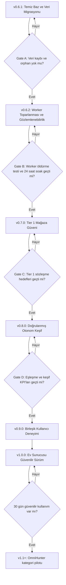

# ShoeHunter AI Stratejik Hedefler ve Yol Haritası

**Hazırlanma tarihi:** 13 Temmuz 2026  
**Değerlendirilen sürüm:** ShoeHunter AI v0.6.0  
**Ana kaynaklar:** `UYGULAMA_SONUC_RAPORU_v0.6.0.md`, mevcut çalışma ağacı, test dosyaları ve 12 Temmuz 2026 tarihli doğrulanmış JSON yedeği  
**Belgenin amacı:** Yeni özellik listesi üretmek değil; mevcut sistemi güvenilir, ölçülebilir ve günlük kullanıma hazır bir v1.0 ürününe götürecek hedefleri ve uygulama sırasını belirlemek

## Executive Summary

- **Mevcut sistem yeniden yazılmamalı.** Güvenlik, mağaza adaptörleri, Ürün Radarı, eşleştirme, alarm, iş kuyruğu ve dağıtım temeli doğru yönde kurulmuş durumda. Bundan sonraki değer, yeni mimari eklemekten çok mevcut mimarinin gerçek veri ve gerçek mağazalarla kanıtlanmasından gelecek.
- **Mevcut sonuç raporu yön olarak doğru, olgunluk konusunda iyimser.** Rapordaki birçok “tamamlandı” ifadesi “kodda mevcut” anlamında doğru; ancak “gerçek veride migrate edildi”, “22 mağazada güvenilir”, “worker çökmesinden sonra toparlanıyor” veya “otonom keşif uzun süre çalıştı” anlamında henüz kanıtlanmış değil.
- **Bir sonraki ana hedef daha fazla mağaza veya daha fazla AI değildir.** Hedef; mevcut 110 ürünü ürün merkezli modele taşımak, en önemli 9 mağazada ölçülen doğruluk oluşturmak, radar akışını canlı kullanmak ve yedi günlük kesintisiz çalışma testini geçmektir.
- **v1.0 için önerdiğim ürün vaadi şudur:** “İstenen beden ve gerçek satın alma fiyatı birlikte doğrulanmış en iyi fırsatı, yanlış stok alarmı üretmeden ve en geç 24 saat içinde bul.” Bu vaat kanıtlanmadan OmniHunter, SaaS, çoklu kullanıcı veya native Android geliştirmesine başlanmamalıdır.

## 1. Benim Değerlendirmem

ShoeHunter AI artık basit bir scraper değildir. Doğru ürün fikrine yaklaşmıştır: kullanıcı mağaza bağlantısını değil, satın almak istediği ürünü takip eder. Kod tarafında bu dönüşümün ana parçaları vardır.

Ancak ürünün bugünkü gerçekliği iki ayrı katmandan oluşuyor:

1. **Yeni mimari:** Ürün Radarı, aday ilanlar, güven skoru, store health, kalıcı iş kuyruğu, browser-worker ve yeni veri kimliği.
2. **Mevcut gerçek veri:** Büyük ölçüde eski link takip modelinden gelen, her ürüne tek ilan bağlı, Intersport ağırlıklı 110 ürünlük veri.

Bu iki katman henüz birleşmemiştir. En önemli iş, yeni özellik eklemek değil, bu birleşmeyi güvenli biçimde tamamlamaktır.

### Sonuç raporuna verdiğim hüküm

| Alan | Rapordaki hüküm | Benim hükmüm | Gerekçe |
| --- | --- | --- | --- |
| Güvenlik | Tamamlandı | Güçlü, üretim ayarı bekliyor | Kod ve test var; gerçek HTTPS/CORS/secret kurulumu sunucuda doğrulanmalı |
| Ürün Radarı | Tamamlandı | Uygulandı, canlı kanıt bekliyor | Gerçek yedekte radar ve discovery kayıtları sıfır |
| Eşleştirme | Tamamlandı | İyi temel, ölçülmemiş | Kritik ayrım testleri var; etiketli ürün korpusu ve precision/recall yok |
| Mağaza dayanıklılığı | Tamamlandı | Altyapı var, mağaza bazında kanıt eksik | 22 motor kayıtlı; gerçek veride 12 mağaza var ve yoğunluk Intersport’ta |
| İş kuyruğu | Tamamlandı | Kısmen güvenilir | Retry/DLQ var; süresi dolmuş `running` işin yeniden alınması eksik |
| Veri migrasyonu | Tamamlandı | Kod hazır, gerçek veri migrate edilmemiş | Yedekte canonical key ve identity v2 kapsamı 0/110 |
| Operasyon | Tamamlandı | Paket hazır, gerçek ortam testi eksik | Docker/Caddy/CI dosyaları var; gerçek Docker kurulum ve soak testi yok |
| Arayüz | Tamamlandı | Temel akış iyi, deneyim bölünmüş | AI Arama “Takibe Al” ile link takibi açıyor; Radar ayrı akışta kalıyor |
| OmniHunter | Temel tamamlandı | Şimdilik beklemeli | Ayakkabı dikeyinde güvenilirlik henüz ölçülmedi |

**Kısa hüküm:** Rapor bir uygulama envanteri olarak güçlüdür; ürün kabul raporu olarak henüz erken davranmaktadır.

## 2. Kanıtlanan Mevcut Durum

12 Temmuz 2026 tarihli doğrulanmış yedek, yeni koddan önce oluşmuş gerçek kullanım verisinin fotoğrafıdır. Bu nedenle aşağıdaki sayılar yeni mimarinin başarısını değil, migrate edilmesi gereken mevcut tabanı gösterir.

| Ölçüm | Mevcut değer | Yorum |
| --- | ---: | --- |
| Ürün | 110 | Aktif ürün tabanı oluşmuş |
| İlan | 110 | Her üründe tam olarak bir ilan var |
| Birden fazla mağaza ilanı olan ürün | 0 | Ürün merkezli çoklu teklif modeli gerçek veride henüz oluşmamış |
| Temsil edilen mağaza | 12 / 22 | Motorların 10’u gerçek veri tabanında hiç temsil edilmiyor |
| Intersport ilanı | 71 / 110 (%64,5) | Sistem başarısı tek mağazanın gücüne fazla bağlı |
| Fiyatı bulunan ilan | 105 / 110 (%95,5) | Mevcut kayıtlar için iyi, fakat örneklem seçilmiş ve Intersport ağırlıklı |
| Beden verisi bulunan ilan | 95 / 110 (%86,4) | İyi temel; mağazalar arasında eşit değil |
| Stok durumu `unknown` | 10 / 110 (%9,1) | Belirsizlik korunuyor; çözülmesi gereken mağazalar var |
| Canonical key kapsamı | 0 / 110 | Yeni ürün kimliği gerçek veriye uygulanmamış |
| Identity v2 kapsamı | 0 / 110 | Başlangıç migrasyonu gerçek tabanda doğrulanmamış |
| Radar / discovery run / candidate | 0 / 0 / 0 | Otonom keşif gerçek kullanımda henüz kanıtlanmamış |
| Store health kaydı | 0 | Sağlık paneli kodda var, operasyonel geçmiş yok |
| Fiyat geçmişi | 9.968 satır | Veri hacmi var, kalite temizliği gerekiyor |
| Ardışık değişmeyen geçmiş oranı | %97,83 | Eski yazma davranışından ciddi tekrar birikmiş |
| Stock status eksik geçmiş satırı | 3.940 / 9.968 (%39,5) | Eski şema yeni analizlere doğrudan güvenli değil |
| Kural | 4; yalnızca 2 ürün | Takip edilen ürünlerin çoğu hedef/beden kuralına bağlı değil |

### Verinin söylediği şey

**Mimari, veriden daha ileride.** Bu kötü bir durum değildir; fakat bir sonraki sürümün işi yeni mimariyi çoğaltmak değil, gerçek veriyi yeni modele güvenli biçimde taşımak ve ölçüm üretmektir.

## 3. Nihai Ürün Hedefi

### v1.0 ürün vaadi

> Kullanıcı bir ürün, beden grubu ve fiyat hedefi tanımlar. ShoeHunter AI, öncelikli Türkiye mağazalarında doğru modeli ve doğru varyantı bulur; gerçek satın alma fiyatını ve beden stoğunu doğrular; yanlış alarm üretmeden fırsatı zamanında bildirir.

### Bu vaadin sınırları

- “En ucuz” yalnızca başarıyla doğrulanan ve kapsama alınan mağazalar arasında söylenir.
- `blocked`, `unknown` veya parser hatası “stok yok” kabul edilmez.
- AI sorguyu anlamaya yardım eder; aynı ürün kararı ve alarm kararı deterministik kurallarla doğrulanır.
- Pazaryerinde fiyat kadar satıcı, kargo, kupon ve varyant da kanıtın parçasıdır.
- Kullanıcıya gösterilen her fırsatın neden eşleştiği açıklanabilir olmalıdır.

### v1.0 kapsam dışı

- Çoklu kullanıcı ve SaaS,
- native Android/iOS uygulaması,
- ayakkabı dışı geniş OmniHunter kategorileri,
- agresif anti-bot yöntemleri,
- bütün 22 mağazayı eşit kalite seviyesinde gösterme iddiası.

## 4. Başarı Ölçütleri

Hedefler önce ölçülebilir olmalıdır. Aşağıdaki eşikler ilk iki haftalık baz ölçümden sonra ayarlanabilir; başlangıçta yön gösteren kabul sınırlarıdır.

### Ana KPI’lar

| KPI | Tanım | v1.0 hedefi | Neden önemli |
| --- | --- | ---: | --- |
| Doğrulanmış fırsat doğruluğu | Bildirildiği anda ürün, beden ve fiyatı tekrar doğrulanabilen alarmlar / kontrol edilen alarmlar | ≥ %95 | Kullanıcı güveninin ana ölçüsü |
| Yanlış stok alarmı | Bildirimde stokta denip satın alma sayfasında istenen beden bulunmayan alarm oranı | < %1 | Projenin temel güvenlik ilkesi |
| Tier 1 keşif kapsamı | Bilinen doğru tekliflerden 24 saat içinde bulunanlar / benchmark teklifleri | ≥ %90 | Sistemin fırsat kaçırıp kaçırmadığını gösterir |
| Tier 1 ürün detay başarısı | Başlık + fiyat + durum okunan sözleşme örnekleri / toplam örnek | ≥ %98 | Mağaza motoru güvenilirliği |
| Beden doğrulama başarısı | Beden destekleyen Tier 1 örneklerde doğru beden durumları / toplam | ≥ %95 | Ayakkabı dikeyinin ayırt edici değeri |
| Keşif tazeliği | Yeni teklifin yayınlanması ile sistemde görünmesi arasındaki süre | p95 ≤ 24 saat | Radarın gerçekten otonom olduğunu kanıtlar |

### Sürücü metrikler

- Otomatik eşleşme precision: **≥ %99**.
- İnceleme kuyruğuna düşen adayların doğru sınıflandırılma oranı: **≥ %90**.
- Zamanı gelen job’ların tamamlanma oranı: **≥ %99 / 24 saat**.
- İki lease süresinden uzun kalan `running` job: **0**.
- Tier 1 mağaza başına en az üç sözleşme örneği: **stokta, stok dışı/belirsiz, indirimli/varyantlı**.
- Günlük yedek başarısı: **%100**; aylık geri yükleme provası: **1**.

### Koruma metrikleri

- `blocked/error/unknown` durumunun `out_of_stock` olarak yazıldığı olay: **0**.
- Aynı olay için cooldown içinde yinelenen Telegram bildirimi: **0**.
- Orphan product/listing/history/alert kaydı: **0**.
- Secret’ın API, log, yedek veya Git çıktısında görünmesi: **0**.
- Mağaza başına tanımlanan istek bütçesinin aşılması: **0**.

## 5. Mağaza Stratejisi

22 mağazanın tamamına aynı “destekleniyor” etiketini vermek yerine yetenek ve kanıt düzeyi açıkça gösterilmelidir.

### Tier 1: Satın alma kararı için güvenilir olmalı

1. Intersport
2. Adidas Türkiye
3. Decathlon
4. Sportive
5. Yalı Spor
6. Amazon Türkiye
7. Nike Türkiye
8. Puma Türkiye
9. New Balance Türkiye

Tier 1’de ürün detay, fiyat, görsel, stok ve desteklenen mağazalarda beden verisi sözleşme testleriyle ölçülmelidir.

### Tier 2: Fırsat keşfi var, bazı alanlar belirsiz olabilir

- Trendyol
- Hepsiburada
- n11
- FLO
- SuperStep
- Barçın
- Boyner

Tier 2’de satıcı/kupon/kargo ve bot engeli açıkça gösterilir. Eksik beden veya arama sonucu “yok” değil “doğrulanamadı” olmalıdır.

### Tier 3: Deneysel veya discovery-only

- Korayspor
- Sneaks Up
- SPX
- Kutupayısı
- ASICS TR
- Skechers TR

Tier 3 sonuçları varsayılan alarm kaynağı olmamalı; önce aday veya inceleme verisi olarak kullanılmalıdır.

### Mağaza terfi kuralı

Bir mağaza daha yüksek Tier’a ancak şu koşullarla çıkar:

- Son 14 günlük sözleşme başarı oranı hedefi geçer.
- Fiyat ve stok alanlarında kritik yanlış üretmez.
- En az üç farklı ürün/varyant örneği vardır.
- Bir parser değişikliği sonrası fixture ve canlı sözleşme testi geçer.

## 6. Hedef ve Sürüm Akışı



## 7. Ayrıntılı Hedef Planı

### Hedef 0 — v0.6.1: Temiz Baz ve Veri Migrasyonu

**Amaç:** Kod, Git ve gerçek MongoDB verisini aynı sürüm gerçeğinde buluşturmak.

**Neden ilk sırada:** Mevcut çalışma ağacı temiz bir sürüm değil; gerçek yedek de canonical identity, radar ve yeni alarm şemasına migrate edilmemiş durumda. Bu taban düzelmeden yapılan her canlı test belirsiz olur.

**İş akışı:**

1. Mevcut çalışma ağacındaki kaynak, eski `gecici/` verileri, tanılama betikleri ve gerçek ürün kodunu sınıflandır.
2. Yalnız gerekli kaynakları içeren temiz bir sürüm adayı oluştur.
3. Mevcut 5,3 MB JSON yedeğini ve Mongo arşivini ayrı yerde koru.
4. Üretim veritabanının klonunda başlangıç migrasyonunu çalıştır.
5. Önce/sonra ürün, listing, rule, alert ve history sayılarını karşılaştır.
6. Canonical identity çakışmalarını otomatik silmek yerine inceleme listesine çıkar.
7. Eski fiyat geçmişindeki değişmeyen tekrarlar için “ham arşiv + sıkıştırılmış aktif geçmiş” stratejisi uygula.
8. Eski alarm kayıtlarını yeni tip/dedup şemasına migrate et veya salt okunur legacy arşive taşı.
9. `memory/PRD.md` dosyasını mevcut v0.6 mimarisiyle eşitle.
10. Temiz baz başarıyla doğrulanınca sürüm commit/tag’i oluştur.

**Kabul kriterleri:**

- 110 listing veya gerekçeli istisna listesi korunur.
- Orphan kayıt sayısı sıfırdır.
- Canonical key ve identity v2 kapsamı %100 veya açık istisna listesidir.
- Migrate edilen veritabanından JSON yedek alınıp ayrı test veritabanına geri yüklenebilir.
- Eski ham geçmiş kaybolmaz; aktif sorgular tekrar şişmesinden etkilenmez.
- Git sürümünde secret, debug HTML, ekran görüntüsü, kişisel yedek ve geçici lock dosyası yoktur.

**Tahmin:** 2-4 çalışma günü.

### Hedef 1 — v0.6.2: Worker Toparlanması ve Gözlemlenebilirlik

**Amaç:** Bilgisayar, worker veya browser çöktüğünde işlerin sessizce takılı kalmamasını sağlamak.

**Koddan görülen kritik boşluk:** Job claim filtresi yalnızca `pending` işleri alıyor. `running` durumundayken worker ölürse lease süresi dolsa bile job tekrar claim edilmiyor. Lease alanı var, fakat crash recovery tamamlanmış değil.

**İş akışı:**

1. Süresi dolmuş `running` işleri güvenli biçimde yeniden `pending` yapan reaper tasarla.
2. Uzun işler için heartbeat/lease yenileme ekle.
3. Worker kapatma sırasında aktif job durumunu güvenli bırak.
4. Dead-letter işi inceleme ve yeniden çalıştırma akışı ekle.
5. Queue bazında pending/running/retry/dead sayılarını ve en eski iş yaşını göster.
6. Başlangıç migrasyonu veya kritik indeks başarısızsa API’nin yalnızca warning ile devam etmesini engelle; readiness başarısız olmalı.
7. Worker öldürme, Mongo kesintisi ve browser timeout senaryolarını otomatik test et.
8. 24 saatlik yerel soak testi çalıştır.

**Kabul kriterleri:**

- Worker zorla kapatıldıktan sonra job lease sonunda otomatik devam eder.
- İki lease süresinden uzun `running` job kalmaz.
- Aynı idempotency key iki kez yan etki üretmez.
- Dead-letter işi arayüz veya yönetici API’sinden görülebilir ve kontrollü replay edilebilir.
- Kritik migration/index hatasında readiness kırmızı olur; uygulama yanlışlıkla “hazır” görünmez.
- 24 saat boyunca iş kaybı, duplicate alarm ve kontrolsüz browser çoğalması oluşmaz.

**Tahmin:** 3-5 çalışma günü.

### Hedef 2 — v0.7.0: Tier 1 Mağaza Güveni

**Amaç:** “22 motor var” bilgisini, hangi mağazada hangi alanın gerçekten güvenilir olduğunu gösteren kanıta dönüştürmek.

**İş akışı:**

1. Her Tier 1 mağaza için stokta, stok dışı/belirsiz ve indirimli/varyantlı en az üç kontrollü URL belirle.
2. HTML fixture’larını kişisel veri ve gereksiz sayfa yükünden arındırarak sakla.
3. Parser fixture testlerini başlık, fiyat, eski fiyat, sepet/kupon, görsel, model kodu ve beden alanlarına göre standartlaştır.
4. Düşük sıklıkta gece çalışan canlı sözleşme testleri kur.
5. Her mağaza için capability alanını gerçek test sonucuyla eşleştir.
6. Parser başarısızlığını geliştirici alarmına bağla; kullanıcıya stok alarmı üretme.
7. 14 günlük mağaza sağlık geçmişi ve sürüm değişim çizgisi tut.
8. Tier 2/Tier 3 mağazaları başarı kanıtına göre terfi veya düşür.

**Kabul kriterleri:**

- Tier 1 ürün detay başarı oranı ≥ %98.
- Tier 1 fiyat ve görsel başarı oranı ≥ %98.
- Beden destekleyen Tier 1 mağazalarda beden doğruluğu ≥ %95.
- Yanlış `out_of_stock` sınıflandırması < %1.
- Her Tier 1 mağazada en az üç fixture ve bir kontrollü canlı sözleşme örneği bulunur.
- Sağlık panelinde örneklem sayısı, son başarı, son hata ve parser sürümü görünür.

**Tahmin:** 8-12 çalışma günü; mağaza değişikliklerine bağlıdır.

### Hedef 3 — v0.8.0: Doğrulanmış Otonom Keşif

**Amaç:** Ürün Radarı’nın yalnızca kayıt oluşturduğunu değil, yeni mağaza ilanını doğru ürünle eşleştirip bulduğunu kanıtlamak.

**İş akışı:**

1. En az 100 sorgu ve 500 adaydan oluşan etiketli eşleşme korpusu hazırla.
2. Korpusa GTS/non-GTS, GTX, Max, Wide, kadın/erkek/çocuk, nesil, apparel ve yanlış kategori örneklerini koy.
3. Auto/review/reject eşiklerini korpus üzerinden ölç.
4. Detay sayfası okunamayan “auto” adayın sessizce bağlı görünmesini engelle; review/error durumuna taşı.
5. Yeni listing, duplicate önleme, review kararı, yanlış nesil, yanlış cinsiyet ve renk politikası için uçtan uca discovery testleri ekle.
6. Mevcut ürünlerden en az beş gerçek radar oluştur: farklı marka, beden ve mağaza kapsamları kullan.
7. Bu radarları en az yedi gün çalıştır.
8. Bilinen mağaza teklifleriyle keşif sonuçlarını günlük karşılaştır.
9. Aynı canonical ürün altında en az üç örnekte birden fazla mağaza listing’i göster.
10. Kaçırılan ve yanlış bulunan adayları review verisi olarak benchmark’a geri besle.

**Kabul kriterleri:**

- Otomatik eşleşme precision ≥ %99.
- Tier 1 bilinen teklif keşif kapsamı ≥ %90 / 24 saat.
- Yanlış ürünün otomatik bağlanma oranı < %1.
- Detay doğrulaması başarısız aday `attached` veya başarılı `auto` sayılmaz.
- Beş canlı radar yedi gün boyunca discovery run üretir.
- En az üç canonical üründe iki veya daha fazla mağaza ilanı vardır.
- Radar, candidate, discovery run ve store health koleksiyonları gerçek ve açıklanabilir veri üretir.

**Tahmin:** 8-12 çalışma günü + 7 günlük gözlem penceresi.

### Hedef 4 — v0.9.0: Birleşik Kullanıcı Deneyimi

**Amaç:** AI Arama, link takibi, Ürünler ve Ürün Radarı’nı tek bir satın alma yolculuğuna dönüştürmek.

**Bugünkü kopukluk:** AI Arama’daki “Takibe Al” işlemi doğrudan product/listing oluşturuyor. Ürün Radarı ise ayrı sayfada ayrı kayıt oluşturuyor. Kullanıcı açısından iki takip modeli var.

**Önerilen ana akış:**

```text
İhtiyaç veya ürün adı
  -> AI/normal sorgu yapılandırma
  -> ürün ve beden onayı
  -> Radar oluştur
  -> mağaza tekliflerini tek ürün altında karşılaştır
  -> hedef/beden koşulu
  -> doğrulanmış alarm
  -> kullanıcı geri bildirimi
```

**İş akışı:**

1. AI Arama sonucundaki “Takibe Al” işlemini varsayılan olarak Radar oluşturma akışına bağla.
2. Link ile eklemeyi “bu teklifi mevcut ürüne bağla veya yeni ürün oluştur” kararına dönüştür.
3. Ürünler sayfasını canonical ürün kartı + mağaza teklifleri modeliyle göster.
4. En ucuz fiyat, en ucuz istenen bedenli fiyat ve doğrulama zamanı ayrı gösterilsin.
5. Global fiyat düşüşü ve kullanıcı radar kuralı alarmlarını ayır; bildirim tercihleri ekle.
6. Alarmda eşleşme nedeni, beden kanıtı, fiyat türü ve son doğrulama zamanı göster.
7. İlk kullanım akışını tek radar oluşturacak kadar sadeleştir.
8. Telefon/PWA üzerinde radar oluşturma, alarm açma ve mağaza bağlantısına gitme akışını test et.
9. Debug Lab’i normal navigasyondan çıkarıp yönetici bakım alanına taşı.
10. Frontend için component ve E2E testleri ekle.

**Kabul kriterleri:**

- Yeni kullanıcı iki dakikadan kısa sürede ilk radarını oluşturabilir.
- AI Arama’dan tek ürünün link takibi yerine radar oluşturulabilir.
- Aynı ürünün birden fazla mağaza teklifi tek ekranda karşılaştırılır.
- Kullanıcı global event alarmı ile kendi hedef alarmını ayırt edebilir.
- Masaüstü ve 390×844 mobil temel akış E2E testinden geçer.
- Frontend yalnızca API adres testi değil, Radar/Ürün/Alarm bileşen testlerine sahiptir.

**Tahmin:** 6-10 çalışma günü.

### Hedef 5 — v1.0.0: Ev Sunucusu Güvenilir Sürüm

**Amaç:** Sistemi evde sürekli açık bir bilgisayar, mini PC veya sunucuda güvenle çalıştırmak.

**İş akışı:**

1. Temiz repodan tamamen yeni bir makineye Docker kurulumu yap.
2. Mongo, API, default worker, browser-worker, scheduler, frontend ve Caddy servislerini doğrula.
3. HTTPS, Secure cookie ve kesin CORS ile telefon/tablet erişimini test et.
4. Günlük JSON + periyodik Mongo yedeğini gerçek disk yoluna bağla.
5. Tam restore provasını boş veritabanında yap ve süreyi ölç.
6. API, queue, store health, disk alanı, backup yaşı ve cert süresi için operasyon kontrol listesi oluştur.
7. Beş radar ve Tier 1 sözleşme testleriyle yedi günlük soak testi çalıştır.
8. İşletim ve kurtarma adımlarını teknik olmayan kısa runbook’a yaz.
9. Kabul kapıları geçince `v1.0.0` tag’i oluştur.

**Kabul kriterleri:**

- Yedi gün boyunca manuel süreç başlatmadan scheduler ve worker çalışır.
- Kritik stuck job, veri kaybı veya duplicate alarm oluşmaz.
- Günlük yedeklerin %100’ü doğrulanır.
- Boş veritabanına geri dönüş süresi 30 dakikanın altındadır.
- Telefon ve tablet aynı LAN’da tekrar giriş sonrası veri alabilir.
- HTTPS kurulumunda cookie, CORS ve CSRF akışları geçer.
- Tier 1 KPI hedefleri yedi günlük pencerede korunur.

**Tahmin:** Kurulum için 2-3 gün + en az 7 günlük soak.

### Hedef 6 — v1.1+: OmniHunter Kategori Pilotu

**Başlama koşulu:** ShoeHunter v1.0 en az 30 gün çalışmalı; yanlış stok alarmı, discovery kapsamı ve backup hedefleri korunmalıdır.

**İlk pilot önerisi:** Ayakkabıya yakın spor giyim kategorisi. Decathlon eşofman örneği bu kategori sınırının neden gerekli olduğunu zaten göstermiştir.

**İş akışı:**

1. Ayakkabı bedenini genel `variant_dimensions` modeline dönüştür.
2. Kategoriye göre renk, beden, hacim, model kodu ve satıcı alanlarını tanımla.
3. Ayakkabı kurallarını genel motora zorla taşımak yerine kategori adaptörü kullan.
4. İlk kategoride yalnız iki veya üç Tier 1 mağaza ile pilot yap.
5. Kategoriye özel doğruluk korpusu ve alarm kuralları oluştur.

**Kabul kriterleri:**

- Ayakkabı davranışı bozulmadan yeni kategori izlenir.
- Kategoriye özel varyantlar yanlış ürün birleştirme üretmez.
- Yeni kategori için ayrı ölçülen precision ve stok doğruluğu hedefleri vardır.

## 8. Önerilen Takvim

Bu takvim tek geliştirici + AI iş birliği, mevcut kodun korunması ve dış mağaza değişikliklerinin sınırlı olması varsayımıyla tahminidir.

| Dönem | Sürüm | Ana sonuç |
| --- | --- | --- |
| 13-17 Temmuz 2026 | v0.6.1 | Temiz repo, klon DB migrasyonu, veri bütünlüğü |
| 18-23 Temmuz 2026 | v0.6.2 | Job crash recovery, readiness, operasyon metrikleri |
| 24 Temmuz-7 Ağustos 2026 | v0.7.0 | Tier 1 mağaza sözleşmeleri ve sağlık kanıtı |
| 8-21 Ağustos 2026 | v0.8.0 | Etiketli eşleşme korpusu ve canlı radar kanıtı |
| 22 Ağustos-2 Eylül 2026 | v0.9.0 | Birleşik AI Arama/Radar/Ürün deneyimi |
| 3-12 Eylül 2026 | v1.0.0 | Temiz kurulum, restore provası ve 7 günlük soak |
| Ekim 2026 veya sonrası | v1.1+ | Başarı kapıları geçerse OmniHunter pilotu |

Takvim hedef değil, bağımlılık sırasıdır. Bir Gate geçmezse sonraki sürüme başlanmamalıdır.

## 9. Kabul Kapıları

| Gate | Geçiş sorusu | Kanıt |
| --- | --- | --- |
| Gate A — Veri | Migrate edilen veri eksiksiz ve geri yüklenebilir mi? | Önce/sonra sayımları, orphan testi, restore raporu |
| Gate B — Runtime | Worker ölürse işler kendiliğinden toparlanıyor mu? | Kill test, lease/reaper testi, 24 saat soak |
| Gate C — Mağaza | Tier 1 mağazalar tanımlı kalite hedeflerini geçiyor mu? | Fixture + canlı sözleşme matrisi |
| Gate D — Keşif | Radar doğru ilanı buluyor ve yanlış ürünü bağlamıyor mu? | Etiketli korpus, precision, discovery coverage |
| Gate E — Deneyim | Kullanıcı ürün merkezli akışı kolayca tamamlıyor mu? | E2E ve mobil görev testi |
| Gate F — v1 | Sistem yedi gün gözetimsiz ve geri yüklenebilir çalıştı mı? | Soak, backup, restore, health kayıtları |

## 10. Teknik Borç Sırası

Teknik borçlar özellik geliştirmesini engelledikleri sırada ele alınmalıdır.

1. **Gerçek veri migrasyonu ve temiz Git bazının olmaması.**
2. **Expired running job recovery eksikliği.**
3. **Başlangıç migrasyon hatasının warning ile yutulması.**
4. **Discovery ve alarm uçtan uca testlerinin eksikliği.**
5. **22 mağaza için standart canlı sözleşme matrisi olmaması.**
6. **AI Arama ve Radar’ın iki ayrı takip modeli oluşturması.**
7. **`server.py` dosyasının yaklaşık 1.764 satır ve 63 rota olması.**
8. **`engines.py` ve `services.py` içinde çok fazla sorumluluk bulunması.**
9. **Frontend testlerinin yalnızca API adres çözümünü kapsaması.**
10. **PRD’nin eski `/app` yollarını ve tamamlanmış backlog maddelerini hâlâ taşıması.**

Router/modül ayrımı Hedef 1-4 sırasında davranış değişikliği yapılan alanlarda kademeli yapılmalıdır. Büyük tek seferlik yeniden yazım önerilmez.

## 11. Riskler ve Önlemler

| Risk | Etki | Olasılık | Önlem |
| --- | --- | --- | --- |
| Mağaza HTML veya API değişimi | Fiyat/beden kaybı | Yüksek | Fixture + düşük sıklıklı canlı sözleşme + parser sürümü |
| Bot engeli | Kapsama kaybı | Yüksek | Tier düşürme, circuit breaker, `unknown/blocked`, izinli keşif kaynakları |
| Yanlış canonical merge | Farklı ürünlerin birleşmesi | Orta-yüksek | Klon DB, dry-run, inceleme listesi, model kodu önceliği |
| Worker ölümü | Sessiz job kaybı | Yüksek | Reaper, heartbeat, kill test, stuck-job alarmı |
| Alarm gürültüsü | Kullanıcı güven kaybı | Orta | Radar ve global event tercihleri, cooldown, feedback |
| Geçmiş veri şişmesi | Yavaş sorgu ve büyük yedek | Gerçekleşmiş | Ham arşiv + değişiklik bazlı aktif geçmiş + indeks |
| Tek mağaza yoğunluğu | Yanlış “piyasa” algısı | Gerçekleşmiş | Tier 1 kapsamı ve mağaza başına kalite/kapsama metriği |
| Secret/HTTPS yanlış ayarı | Güvenlik açığı | Orta | Kurulum doğrulayıcı, readiness ve release checklist |
| Erken OmniHunter genişlemesi | Odak ve doğruluk kaybı | Yüksek | 30 günlük v1 başarı kapısı |

## 12. Şimdilik Yapılmaması Gerekenler

1. Sırf sayı artsın diye yeni mağaza motoru eklemek.
2. Tier bilgisi olmadan 22 mağazanın tamamını eşit güvenilir göstermek.
3. Gerçek veri migrasyonunu üretim veritabanında doğrudan denemek.
4. Etiketli korpus olmadan eşleşme eşiklerini sürekli değiştirmek.
5. Native Android uygulaması yazmak; mevcut PWA ve LAN akışı önce güvenilir olmalı.
6. Çoklu kullanıcı, abonelik veya SaaS altyapısına geçmek.
7. Ayakkabı dikeyi kanıtlanmadan OmniHunter kategorilerini çoğaltmak.
8. Bot engelini stok yok gibi yorumlamak.
9. LLM’i aynı ürün veya alarm doğruluğunda son karar mercii yapmak.
10. “Testler geçti” sonucunu “canlı mağazalarda güvenilir” sonucuyla eşitlemek.

## 13. İlk Uygulama Sırası

Bir sonraki çalışma oturumunda önerdiğim kesin sıra:

1. Temiz repo kapsamını belirle ve v0.6.0 kaynak listesini dondur.
2. Yedeği klon veritabanına geri yükle.
3. Migrasyonu klonda çalıştır ve önce/sonra veri kalite raporu üret.
4. Queue crash recovery tasarımını ve testlerini tamamla.
5. Intersport, Adidas, Decathlon, Sportive, Yalı Spor ve Amazon ile ilk Tier 1 sözleşme matrisini kur.
6. Beş gerçek Ürün Radarı oluşturup yedi günlük gözlemi başlat.
7. Gözlem sürerken etiketli eşleşme korpusunu hazırla.
8. Sonuçlara göre v0.7/v0.8 eşiklerini ayarla.
9. Ardından AI Arama ile Radar akışını birleştir.
10. En son temiz sunucu kurulum ve v1.0 soak testine geç.

## 14. Karar Bekleyen Sorular

Bu sorular çalışmayı durdurmaz; önerilen varsayılan cevaplar parantez içindedir.

- v1.0 için en önemli mağazalar hangileri? (**Varsayılan: Tier 1’deki 9 mağaza**)
- Sistem hangi cihazda sürekli açık kalacak? (**Varsayılan: Docker çalıştıran ev bilgisayarı/mini PC**)
- Kullanıcı fiyat düşüşü genel alarmlarını mı, yalnız kendi radar koşullarını mı istiyor? (**Varsayılan: yalnız radar; genel olaylar isteğe bağlı**)
- “En ucuz” iddiası yalnız doğrulanan mağazaları mı kapsayacak? (**Varsayılan: evet, kapsam açıkça gösterilecek**)
- Amazon Creators API için uygun hesap ve yetki var mı? (**Varsayılan: yok; HTML motoru + belirsizlik politikası**)
- Brave URL keşfi kullanılacak mı? (**Varsayılan: API anahtarı varsa aday URL için, fiyat kaynağı olarak değil**)

## 15. Caveats and Assumptions

- Veri profili 12 Temmuz 2026 tarihli doğrulanmış yedeğe aittir; yeni kod başladıktan sonra oluşacak veriyi temsil etmez.
- Mağaza başarı hedefleri iç benchmark’tır; canlı mağaza sözleşmeleri çalıştırılmadan mevcut oran olarak okunmamalıdır.
- Takvim, dış mağaza değişiklikleri ve hesap/API erişimi nedeniyle kayabilir.
- Bu belge kod değişikliği yapmadan hazırlanmıştır. Mevcut çalışma ağacındaki değişiklikler, silmeler ve kullanıcı dosyaları korunmuştur.

## 16. Nihai Tavsiyem

**ShoeHunter AI’nin bir sonraki başarısı yeni özellik değil, güven kanıtı olmalıdır.**

Sistem şu anda güçlü bir v0.6 mimarisine sahip. v1.0’a giden doğru yol; önce gerçek veriyi migrate etmek, sonra worker ve mağaza dayanıklılığını kanıtlamak, ardından radar eşleşmesini ölçmek ve en son kullanıcı deneyimini tek akışta birleştirmektir.

Ben olsam önümüzdeki altı ila sekiz haftada başka kategoriye veya native uygulamaya geçmezdim. Intersport’taki başarıyı diğer mağazalara ölçülü biçimde yayar, beş gerçek radarın yedi gün boyunca doğru çalışmasını v1.0’ın ana sınavı yapardım. Bu sınav geçildiğinde proje yalnızca “çok özellikli” değil, gerçekten güvenilir bir satın alma yardımcısı olur.
