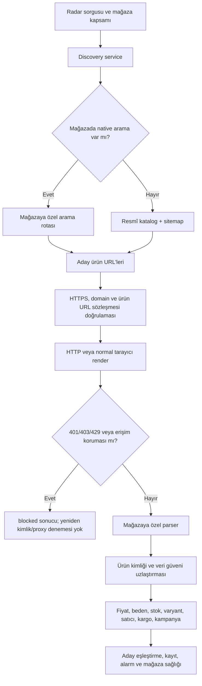

# ShoeHunter Tüm Mağazalar Özel Motor Uygulama ve Test Raporu

**Rapor tarihi:** 18 Temmuz 2026  
**Hedef kitle:** Teknik proje ekibi, ürün sorumluları ve devralacak bakım ekibi  
**Uygulanan proje:** `C:\Users\ÖGR1\Documents\Ayakkabi`  
**Karşılaştırma başlangıcı:** `D:\urun_ayakkabi` denetiminde bulunan iyileştirme fikirleri ve uygulama öncesi mağaza motoru mimarisi  
**Kapsam:** Denetim bulgularının seçici aktarımı, tüm kayıtlı mağazalar için özel motor sözleşmesi, yeni outdoor mağazaları, Radar mağaza seçimi, güvenilirlik sertleştirmeleri ve testler  
**Teslim türü:** Uygulama sonrası teknik devir raporu  
**Durum:** Kod uygulanmış ve yerel testleri geçmiştir; Git commit'i veya üretim dağıtımı yapılmamıştır

---

## 1. Teknik özet

Bu çalışma sonunda ShoeHunter'ın aktif motor kayıt defterindeki **27 mağazanın 27'si benzersiz bir motor sınıfıyla** temsil edilmektedir. Daha önce ortak/fabrika tanımıyla çalışan 12 mağaza için ayrı sınıflar oluşturulmuş, ayrıca **Brooks Türkiye, Columbia Türkiye, Salomon Türkiye ve The North Face Türkiye** sisteme eklenmiştir. Ortak ayrıştırma çekirdeği korunmuş; domain, ürün URL sözleşmesi, arama kartları, fiyat/beden/stok/varyant seçicileri ve mağazaya özgü istisnalar ayrı sınıflarda tutulmuştur.

Ana sonuçlar:

- **27 benzersiz slug ve 27 benzersiz motor örneği** çalışan registry çıktısıyla doğrulandı.
- **25 mağazada native arama rotası**, **2 mağazada katalog + sitemap keşfi** bulunuyor. Native arama rotası olmayan mağazalar ASICS ve Columbia'dır.
- **27/27 motor beden**, **25/27 motor varyant**, **6/27 motor satıcı verisi**, **1/27 motor görünür sepet teklifi fiyatı** yeteneği ilan ediyor.
- Hepsiburada ve n11 için ayrı pazar yeri motorları; Trendyol ve Amazon için mevcut özel motorlar korunup yetenek sözleşmesine bağlandı.
- Radar ekranına tek tek mağaza seçimi, **Tümünü seç**, **Temizle**, seçili mağaza sayısı ve boş seçimde gönderimi engelleme eklendi.
- Fiyatın başka ürün kartından yanlış alınmasını önleyen ürün kimliği doğrulaması, eşit aday belirsizliği, harici domain reddi ve bilinmeyen beden stok durumu eklendi.
- HTTP 401/403/429 ve CAPTCHA/erişim koruması sinyalleri terminal durum kabul ediliyor; farklı kimlik, proxy veya stealth yöntemiyle yeniden denenmiyor.
- Son doğrulamada backend **110 geçti, 1 atlandı**; odak motor/keşif paketi **57/57**; frontend **8/8**; üretim derlemesi ve odak Ruff denetimi başarılı oldu.
- Son kodla dört resmî outdoor ürün sayfasını kapsayan kontrollü canlı testte **4 URL'nin tamamı**, tek test akışı içinde sözleşmeyi geçti.

### Sonuç kararı

**Kayıtlı mağazaların tamamı için özel motor sınıfı hedefi karşılandı.** “Intersport kadar güçlü” hedefi ortak veri sözleşmesi ve ayrıştırma dayanıklılığı bakımından büyük ölçüde karşılandı; ancak her mağazada birebir özellik eşitliği iddia edilmemelidir. Örneğin yalnız Intersport sayfasında görünür sepet teklifi ayrıştırması doğrulanmıştır; pazar yerlerinde giriş, sepete ekleme, kupon uygulama veya ödeme işlemi yapılmamıştır. Canlı doğrulanmayan rotalar ve korumalı pazar yeri sayfaları ayrıca işaretlenmiştir.

---

## 2. Raporun sorusu, kapsamı ve karşılaştırma temeli

Bu rapor şu soruya cevap verir:

> `D:\urun_ayakkabi` denetiminde bulunan iyileştirmeler seçici olarak ana projeye aktarıldıktan ve özel mağaza motoru kapsamı genişletildikten sonra, sistemde ne değişti, hangi mağazalar hangi yeteneklere sahip, hangi sonuçlar test edildi ve hangi riskler hâlâ açık?

### Kapsama dahil

- Önceki denetimde bulunan güvenilir iyileştirmelerin ana projeye seçici aktarımı
- Aktif `ENGINES` kayıt defterindeki tüm mağazalar
- Ürün ve arama sonucu ayrıştırması
- Fiyat, eski fiyat, beden, beden stoku, genel stok, varyant, görsel ve ürün kimliği
- Pazar yeri satıcı, satıcı puanı, kargo ve kampanya alanları
- Native arama, katalog, sitemap ve isteğe bağlı Brave URL keşfi
- Radar mağaza kapsamı kullanıcı arayüzü
- Erişim korumasında güvenli durma davranışı
- Ağsız fixture testleri, yerel entegrasyon testleri, frontend testleri, üretim derlemesi ve sınırlı canlı sözleşme testi

### Kapsam dışı

- Giriş yapılmış kullanıcı hesabı işlemleri
- Gerçek sepete ürün ekleme, favori oluşturma, sipariş, ödeme veya kupon uygulama
- CAPTCHA çözme, robots kurallarını atlatma, stealth eklentisi, tarayıcı parmak izi sahteciliği, kimlik taklidi veya proxy rotasyonu
- Yoğun yük testi, sürekli scraping veya erişim korumasına karşı direnç testi
- Her mağazanın her ürün kategorisinde canlı uçtan uca doğrulama
- Üçüncü taraf mağazaların kullanım şartları veya hukuki uygunluk görüşü
- Üretim dağıtımı, Git commit'i, branch temizliği veya veritabanı migrasyonu

### Karşılaştırma temeli

İlk salt okunur inceleme [D projesi karşılaştırmalı denetim raporunda](./D_PROJESI_KARSILASTIRMALI_DENETIM_RAPORU_2026-07-14.md) kaydedilmişti. Bu uygulama aşamasında aday proje bütünüyle kopyalanmadı. Faydalı parçalar testleriyle birlikte seçici olarak alındı; denetimde tespit edilen hatalı veya eksik davranışlar aynı biçimde taşınmadı.

---

## 3. Önceki denetim bulgularının aktarım durumu

| Önceki bulgu / öneri | Uygulama sonucu | Kanıt | Durum |
|---|---|---|---|
| Adidas iç içe JSON-LD ve `ProductGroup` desteği | İç içe yapı, tekil `Product` yedeği, DOM fiyat yedeği ve tarayıcı bekleme desteği ana projeye alındı | `test_adidas_reads_product_group_inside_graph`, Adidas parser testleri | Tamamlandı |
| HTTP karakter kodlamasının düzeltilmesi | Yanıt baytları önce UTF-8, gerekirse sunucunun bildirdiği kodlamayla güvenli biçimde çözülüyor | `StoreEngine.fetch()` | Tamamlandı |
| Kuyrukta süresi dolan işlerin geri alınması | Worker kimliği ve `lease_until` ile aktif iş korunuyor, süresi dolmuş iş tekrar alınabiliyor | `test_expired_running_job_is_reclaimed_but_active_lease_is_not` | Tamamlandı |
| Düşük güvenli fiyat düşüşünde çalışma zamanı hatası | Düşük güvenli veri alarm izleyicilerini sorgulamadan güvenli biçimde atlanıyor | `test_low_confidence_price_drop_is_safely_skipped` | Tamamlandı |
| Trendyol gerçek ürün URL'lerinin reddedilmesi | Gerçek `-p-<id>` sözleşmesi ve gömülü ürün verisi desteği düzeltildi | `test_trendyol_accepts_real_product_url_and_reads_embedded_data` | Tamamlandı |
| Telegram geri bildiriminin eksik webhook güvenliği | Callback kodları sınırlandı, webhook secret-token doğrulaması ve güvenli bot secret saklama eklendi | Telegram testleri, `server.py` callback akışı | Tamamlandı |
| Mağaza sağlık ekranında zaman aralığı/devre kesici karışıklığı | 24 saatlik metrik ve devre kesici durumu ortak snapshot üzerinden sunuluyor | `test_health_snapshot_exposes_consistent_24h_metrics_and_circuit_state` | Tamamlandı |
| MongoDB naive/aware datetime uyumsuzluğu | Devre kesici denetimi naive Mongo tarihini kabul ediyor | `test_store_circuit_accepts_naive_mongodb_datetime` | Tamamlandı |
| Cookie güvenlik ayarındaki gevşeme riski | Oturum ve CSRF çerezlerinde `SameSite=Strict`; değişikliklerde CSRF zorunlu | güvenlik kodu ve entegrasyon testleri | Tamamlandı |
| Yeni özelliklerin kalıcı testlere alınmaması | Denetim, kuyruk, mağaza, güvenlik, discovery ve Radar testleri aktif test dizinine alındı | Son test toplamları | Tamamlandı |

Bu tablo yalnız önceki denetim maddelerinin durumunu gösterir. Bu çalışmanın asıl ek kapsamı, 27 mağazalık özel motor mimarisi ve Radar mağaza seçimidir.

---

## 4. Yeni motor mimarisi

### 4.1 Akış



### 4.2 Tasarım kararı: ayrı sınıf, ortak güvenilir çekirdek

Her mağaza için tamamen kopyalanmış bir parser oluşturulmadı. Bunun yerine iki katman kullanıldı:

1. `StructuredRetailEngine`: JSON-LD, gömülü state, kapsamı daraltılmış DOM fiyatları, beden, stok, varyant ve arama kartı için ortak dayanıklı çekirdek.
2. Mağazaya özel sınıf: domain, ürün URL deseni, arama rotası, seçiciler, tarayıcı gereksinimi, katalog tohumları ve siteye özgü istisnalar.

Bu yapı, “her mağazanın ayrı motoru” şartını karşılar; aynı zamanda 16 benzer parser kopyasının zamanla birbirinden kopmasını engeller. `make_engine` tabanlı generic kayıtlar kaldırılmıştır; kayıt defterinde doğrudan sınıf örnekleri bulunur.

### 4.3 Ortak çıktı sözleşmesi

Tüm motorlar aşağıdaki alanları aynı biçimde döndürür; veri bulunamazsa alan silinmez, `null`, boş liste veya `unknown` kullanılır:

- Mağaza: `store`, `store_slug`, `url`
- Kimlik: `title`, `brand`, `model`, `model_code`, `gtin`
- Nitelik: `gender`, `color`, `width`, `image`
- Fiyat: `current_price`, `old_price`, `cart_price`, `currency`, `price_source`, `confidence`
- Stok: `sizes`, `stock_count`, `in_stock`, `stock_status`, `availability`
- Varyant: `variant_urls`
- Pazar yeri: `seller`, `seller_rating`, `official_seller`, `shipping`, `campaigns`
- Denetim: `checked_at`, `evidence`, `debug.price_candidates`, `debug.variant_source`, `debug.notes`

Bu sözleşme sayesinde üst katman mağazaya göre farklı alan adları taşımak zorunda kalmaz.

---

## 5. 27 motorun kayıt ve yetenek matrisi

> **Önemli okuma notu:** “Native arama: Var” yalnız kodda `search_path` tanımlı olduğunu gösterir; o rotanın bu turda canlı doğrulandığı anlamına gelmez. “Beden/varyant/satıcı/sepet” sütunları parserın ilan ettiği yeteneklerdir; her ürün sayfasının bu veriyi mutlaka sunacağını garanti etmez.

| # | Slug | Sınıf | İzinli domain(ler) | Native arama | Beden | Varyant | Satıcı | Sepet | Keşif | URL kanıtı |
|---:|---|---|---|---|:---:|:---:|:---:|:---:|---|---|
| 1 | `decathlon` | `DecathlonEngine` | `decathlon.com.tr` | Var: `/search?Ntt={q}` | E | E | H | H | `html+sitemap` | C/F |
| 2 | `adidas` | `AdidasEngine` | `adidas.com.tr` | Var: `/tr/search?q={q}` | E | E | H | H | `browser+sitemap` | C/F |
| 3 | `nike` | `NikeEngine` | `nike.com` | Var: `/tr/w?q={q}` | E | E | H | H | `html+sitemap` | C/F |
| 4 | `puma` | `PumaEngine` | `tr.puma.com`, `puma.com` | Var: `/search?q={q}` | E | E | H | H | `browser+sitemap` | C/F |
| 5 | `newbalance` | `NewBalanceEngine` | `newbalance.com.tr` | Var: `/arama?q={q}` | E | E | H | H | `html+sitemap` | C/F |
| 6 | `sportive` | `SportiveEngine` | `sportive.com.tr` | Var: `/list/?search_text={q}` | E | E | H | H | `html+sitemap` | C/F |
| 7 | `intersport` | `IntersportEngine` | `intersport.com.tr` | Var: `/list/?search_text={q}` | E | E | H | **E** | `html+sitemap` | C/F |
| 8 | `barcin` | `BarcinEngine` | `barcin.com` | Var: `/search?q={q}` | E | E | H | H | `browser+sitemap` | L-P / C-S |
| 9 | `korayspor` | `KoraySporEngine` | `korayspor.com` | Var: `/arama?q={q}` | E | E | H | H | `html+sitemap` | L-P / C-S |
| 10 | `flo` | `FloEngine` | `flo.com.tr` | Var: `/search?q={q}` | E | E | **E** | H | `browser+sitemap` | L-P / C-S |
| 11 | `superstep` | `SuperStepEngine` | `superstep.com.tr` | Var: `/arama?q={q}` | E | E | H | H | `browser+sitemap` | L-P / C-S |
| 12 | `sneaksup` | `SneaksUpEngine` | `sneaksup.com` | Var: `/search?q={q}` | E | E | H | H | `browser+sitemap` | L-P / C-S |
| 13 | `yalispor` | `YaliSporEngine` | `yalispor.com.tr` | Var: `/tum-urunler?q={q}` | E | H | H | H | `html+sitemap` | C/F |
| 14 | `boyner` | `BoynerEngine` | `boyner.com.tr` | Var: `/arama?q={q}` | E | E | **E** | H | `browser+sitemap` | L-P / C-S |
| 15 | `kaptanspor` | `KaptanSporEngine` | `kaptanspor.com.tr` | Var: `/arama/?q={q}` | E | E | H | H | `html+sitemap` | C/F |
| 16 | `spx` | `SpxEngine` | `spx.com.tr` | Var: `/arama?q={q}` | E | E | H | H | `browser+sitemap` | L-P / C-S |
| 17 | `kutupayisi` | `KutupayisiEngine` | `kutupayisi.com` | Var: `/arama?q={q}` | E | E | H | H | `browser+sitemap` | L-P† / C-S |
| 18 | `trendyol` | `TrendyolEngine` | `trendyol.com` | Var: `/sr?q={q}` | E | E | **E** | H | `browser+sitemap` | C/F |
| 19 | `hepsiburada` | `HepsiburadaEngine` | `hepsiburada.com` | Var: `/ara?q={q}` | E | E | **E** | H | `browser+sitemap` | L-D / C-F |
| 20 | `n11` | `N11Engine` | `n11.com` | Var: `/arama?q={q}` | E | E | **E** | H | `browser+sitemap` | L-P / C-S |
| 21 | `amazon` | `AmazonEngine` | `amazon.com.tr` | Var: `/s?k={q}` | E | H | **E** | H | `html+sitemap` | C/F |
| 22 | `asics` | `AsicsEngine` | `asics.com.tr` | **Yok** | E | E | H | H | `catalog+sitemap` | L-P / N |
| 23 | `skechers` | `SkechersEngine` | `skechers.com.tr` | Var: `/arama?q={q}` | E | E | H | H | `browser+sitemap` | L-P / C-S |
| 24 | `brooks` | `BrooksEngine` | `brooksrunning.com.tr` | Var: `/arama?q={q}` | E | E | H | H | `browser+sitemap` | **L-P-S** |
| 25 | `columbia` | `ColumbiaEngine` | `columbia.com.tr` | **Yok** | E | E | H | H | `catalog+sitemap` | **L-P / N** |
| 26 | `salomon` | `SalomonEngine` | `salomon.com.tr` | Var: `/Arama?q={q}` | E | E | H | H | `browser+sitemap` | **L-P-S** |
| 27 | `thenorthface` | `TheNorthFaceEngine` | `thenorthface.com.tr` | Var: `/search?q={q}` | E | E | H | H | `browser+sitemap` | **L-P-S** |

### Kanıt kodları

- **L-P-S:** Resmî canlı ürün URL'si ve native arama rotası bu denetimde doğrulandı.
- **L-P / C-S:** Resmî canlı ürün URL sözleşmesi doğrulandı; native arama rotası yalnız config/fixture düzeyinde, bu turda canlı doğrulanmadı.
- **L-P / N:** Resmî canlı ürün/kategori sözleşmesi doğrulandı; kararlı native sorgu rotası doğrulanamadığı için `search_path=None` ve katalog+sitemap kullanılıyor.
- **L-D / C-F:** Resmî domain/kategori erişimi doğrulandı; güncel ürün URL örneği ve arama sözleşmesi bu turda canlı doğrulanmadı.
- **C/F:** Bu turda güncel canlı resmî istek kanıtı yok; kod yapılandırması ve yerel fixture/test kanıtı var.
- **† Kutupayısı:** Eski/resmî ürün URL biçimi doğrulandı; kategori denetim anında `0 ürün` gösterdi. URL kanıtı güncel stok kanıtı değildir.

### Çalışan registry sayımları

| Ölçüm | Sonuç |
|---|---:|
| Toplam motor örneği | 27 |
| Benzersiz slug | 27 |
| Native arama tanımlı | 25 |
| Katalog+sitemap kullanan | 2 |
| Beden desteği ilan eden | 27 |
| Varyant desteği ilan eden | 25 |
| Satıcı verisi ilan eden | 6 |
| Görünür sepet teklifi fiyatı ilan eden | 1 |
| `browser+sitemap` | 16 |
| `html+sitemap` | 9 |
| `catalog+sitemap` | 2 |

---

## 6. Mağaza gruplarına göre uygulanan farklar

### 6.1 Mevcut güçlü motorlarda korunan ve iyileştirilen davranışlar

- **Adidas:** İç içe JSON-LD, `@graph`, `ProductGroup`, tekil `Product`, beden bazlı stok ve render edilmiş arama kartı desteklenir. Erişim koruması görünürse sonuç `blocked` olur.
- **Decathlon:** JSON-LD/metaveri, uygulama içi SKU-bedeni, stok ve arama kartı ayrıştırması korunmuştur.
- **Nike, Puma, New Balance:** Beden seçicilerinde `disabled`/`aria-disabled` işaretleri stokta yok olarak değerlendirilir; mevcut beden `in_stock=true` döndürür.
- **Sportive:** Next Flight gömülü ürün kartları, stok, indirimli fiyat, ürün başlığı ve varyant desteği korunmuştur.
- **Intersport:** Ürün sayfasında görünür `.product-item__offers` sepet teklifi varsa ayrı `cart_price` olarak alınır. Bu, gerçek sepete ekleme işlemi değildir.
- **Yalı Spor:** Sayfa gövdesindeki gerçek seçilebilir bedenler kullanılır; stok bildirim alanındaki bedenler yanlış biçimde mevcut sayılmaz.
- **Kaptan Spor:** İndirimli/eski fiyat, beden stoku, renk varyantı ve açık stokta yok sinyali desteklenir.
- **Trendyol:** Gerçek ürün URL deseni, gömülü ürün state'i, beden/varyant ve satıcı verisi özel parserda işlenir.
- **Amazon TR:** Fiyat, ana görsel, beden boyutları, beden erişilebilirliği ve satıcı alanları özel parserda işlenir; belirsiz beden stoku `None` kalır.

### 6.2 Daha önce generic olan 12 mağaza

Yeni ayrı sınıflar:

1. `BarcinEngine`
2. `KoraySporEngine`
3. `FloEngine`
4. `SuperStepEngine`
5. `SneaksUpEngine`
6. `BoynerEngine`
7. `SpxEngine`
8. `KutupayisiEngine`
9. `HepsiburadaEngine`
10. `N11Engine`
11. `AsicsEngine`
12. `SkechersEngine`

Bu motorların her biri için domain ve ürün URL sözleşmesi tanımlandı. Kategori veya blog sayfalarının ürün sanılmasını önleyen negatif sözleşme testleri eklendi. Barçın slug tabanlı ürün yolunu, Korayspor model kodu sonunu, FLO sayısal ürün kimliğini, SuperStep model segmentini, Sneaks Up stil kodunu, Boyner `-p-<id>` yapısını, SPX SKU sonunu, Kutupayısı `/urun/` yolunu, n11 sayısal ürün kimliğini, ASICS slug+sayı ve Skechers `p-...-stil` biçimini tanır.

### 6.3 Ana akım pazar yerleri

| Mağaza | Özel motor | Kamusal ürün verisi | Satıcı | Puan/kargo/kampanya | Canlı işlem |
|---|---|---|---|---|---|
| Trendyol | `TrendyolEngine` | fiyat, görsel, beden, stok, varyant | Var | Temel kampanya alanları ortak sözleşmede | Yapılmadı |
| Hepsiburada | `HepsiburadaEngine` | fiyat, görsel, beden, stok, varyant | Var | Fixture ile satıcı puanı, kargo ve kupon | Yapılmadı |
| n11 | `N11Engine` | fiyat, görsel, beden, stok, varyant | Var | Fixture ile satıcı puanı, kargo ve kupon | Yapılmadı |
| Amazon TR | `AmazonEngine` | fiyat, görsel, beden, stok | Var | Sayfadaki kamusal alanlarla sınırlı | Yapılmadı |

Hepsiburada ve n11 için `MarketplaceEngine` ortak pazar yeri alanlarını sağlar; her mağaza yine ayrı sınıf, domain, URL ve seçici setine sahiptir. Pazar yeri motorlarında `supports_cart_price=false` tutuldu; çünkü gerçek sepete ekleme yapılmadan “sepet fiyatı desteği” ilan etmek yanlış bir yetenek beyanı olurdu.

### 6.4 Yeni outdoor motorları

- **Brooks Türkiye:** `/arama?q=` rotası ve `p-...` ürün sözleşmesi. Resmî sayfadaki standart dışı büyük harfli `Price` alanı desteklenir. JSON-LD liste fiyatı ile görünür indirimli fiyat kontrollü biçimde uzlaştırılır.
- **Columbia Türkiye:** Kararlı native arama rotası doğrulanmadığı için sahte bir rota tanımlanmadı. `/ayakkabi?pageIndex=1/2` resmî katalog tohumları, sitemap ve isteğe bağlı URL keşfi kullanılır.
- **Salomon Türkiye:** `/Arama?q=` rotası; `L41737900` gibi SKU ve sayısal iç ürün kimliği URL'leri desteklenir.
- **The North Face Türkiye:** `/search?q=` rotası ve `_134175` gibi sayısal ürün sonu desteklenir.
- **ASICS Türkiye:** Global `asics.com` kapsamdan çıkarıldı; yalnız Türkiye domaini kabul edilir. Native arama yerine erkek/kadın koşu katalog tohumları ve sitemap kullanılır.

---

## 7. Fiyat ve ürün kimliği güvenilirliği

### 7.1 Güven sırası

Motorlar veri kaynaklarını kör biçimde birleştirmez. Uygulanan temel kural şöyledir:

1. Geçerli ürün JSON-LD verisi güçlü kanıttır.
2. Mağazaya özel, mevcut ürünle kimliği eşleşen gömülü state güçlü adaydır.
3. Ürün alanıyla sınırlandırılmış DOM seçicileri zayıf generic kaynakları düzeltebilir.
4. Meta ve genel embedded fiyatlar yalnız yedek kaynaktır.
5. Güçlü JSON-LD fiyatı, sayfadaki “benzer ürünler” kartının daha ucuz fiyatıyla ezilmez.
6. Görünür sepet teklifi yalnız motor açıkça destekliyorsa ve sayfa üzerinde mevcutsa kullanılabilir.

### 7.2 Son sertleştirmeler

- **Tek ilgisiz gömülü ürün:** Sayfada yalnız bir state ürünü olması artık onun otomatik olarak mevcut ürün kabul edilmesine yetmez.
- **Eşit puanlı adaylar:** Aynı isimle eşit kimlik puanı alan farklı ID/fiyatlı iki aday varsa fiyat yükseltilmez; durum belirsiz kabul edilir.
- **Harici ürün URL'si:** Gömülü state başka domaine yöneliyorsa aday doğrudan reddedilir.
- **Aynı site, farklı ürün URL'si:** Öneri kartı olma olasılığı nedeniyle reddedilir.
- **Kimlik eşiği:** URL, model kodu veya yeterli isim benzerliğiyle en az doğrulama puanı gereklidir.
- **İlgili kart fiyatı:** Güvenilir ürün JSON-LD fiyatı korunur; kart fiyatı yalnız debug adayında `not_promoted` olarak görülebilir.
- **Beden stok üç durumu:** `True`, `False`, `None`. Kanıt yoksa beden stokta varsayılmaz.
- **Bağlı disabled input:** `<label for=...>` ile bağlı devre dışı input da stokta yok sayılır.

Bu önlemler, “en düşük sayıyı bul ve fiyat say” yaklaşımından kaynaklanan yanlış ucuzluk alarmı riskini belirgin biçimde azaltır.

---

## 8. Keşif sistemi

### 8.1 Katmanlar

Bir sorgu için keşif katmanları mağazanın yeteneğine göre çalışır:

- Native mağaza araması
- Resmî kategori/katalog tohumları
- Resmî sitemap
- API anahtarı yapılandırılmışsa Brave üzerinde yalnız ilgili domain URL keşfi

Katalog fallback'i yalnız URL döndürmez; arama kartından alınabilen **görsel ve fiyatı** da discovery sonucunda korur.

### 8.2 Robots davranışı

- `robots.txt` okunabildiğinde `ShoeHunterAI` kullanıcı ajanı için hedef katalog URL'sindeki açık `Disallow` kuralı katalog isteğini; site kökünü yasaklayan kural da sitemap keşfini durdurur.
- Bu davranış ağsız testte doğrulanmıştır.
- Mevcut kodda `robots.txt` alınamazsa parser varsayılan olarak erişime izin verir. Bu bir koruma atlatma yöntemi değildir; ancak daha katı kurumsal uyum isteniyorsa “robots bilinmiyor = ertele” politikasına çevrilmesi değerlendirilmelidir.
- CAPTCHA veya erişim challenge sayfası algılanırsa discovery sonucu kullanılmaz.

### 8.3 Trafik ve kaynak sınırları

- Katalog/sitemap cache süresi varsayılan olarak 6 saattir.
- Tarayıcı eşzamanlılığı varsayılan olarak global 2, mağaza başına 1'dir.
- Ağ yanıt boyutu sınırlandırılmıştır.
- 401/403/429 durumları terminaldir; farklı kimlikle yeniden denenmez.
- Normal istemciyle veri gelmeyen kamusal, istemci tarafında render edilen sayfa için en fazla bir normal browser-render fallback'i vardır.

---

## 9. Radar mağaza seçimi

### Uygulanan kullanıcı davranışı

- `/stores` registry'deki 27 motorun tamamını `searchable=true` döndürür.
- `native_search`, native arama rotası olup olmadığını ayrıca gösterir.
- Radar formu ilk açıldığında mevcut tüm aranabilir mağazalar seçilir.
- Kullanıcı her mağazayı checkbox ile tek tek açıp kapatabilir.
- **Tümünü seç** 27 slugın tamamını açıkça `store_scope` alanına koyar.
- **Temizle** seçimi boşaltır.
- Seçili/toplam mağaza sayısı gösterilir.
- En az bir mağaza seçilmediyse uyarı görünür ve form gönderilemez.
- Tek başına Brooks, Columbia, Salomon veya The North Face seçilebilir.

### Bilinen API semantik farkı

Frontend'de boş seçim “geçersiz” kabul edilir. Backend'in eski sözleşmesinde ise doğrudan API'ye `store_scope: []` göndermek “tüm mağazalar” anlamına gelir. Arayüz, yanlışlıkla bütün mağazaları çalıştırmamak için gönderimi engeller; fakat başka bir API istemcisi boş liste gönderirse bütün motorlar çalışır.

**Öneri:** Bir sonraki sözleşme sürümünde “tümü” için açık bir `all_stores=true` veya `store_scope=null` anlamı belirlenmeli; boş liste tek bir anlam taşımalıdır.

---

## 10. Erişim koruması ve güvenlik sınırı

Kullanıcının daha sonra robots/CAPTCHA/erişim korumasını stealth, kimlik sahteciliği veya proxy rotasyonuyla aşma talebi **uygulanmadı**. Bu raporun teslim ettiği sistem aşağıdaki sınırda kalır:

### Uygulanan güvenli yöntemler

- Kamusal HTML, JSON-LD, gömülü sayfa state'i, resmî katalog ve sitemap
- Normal HTTP istemcisi
- Kamusal sayfanın JavaScript ile render edilmesi gerekiyorsa normal Playwright Chromium
- Sabit ve açık kullanıcı ajanı; kimlik rotasyonu yok
- İzinli domain listesi, HTTPS ve uzak URL doğrulaması
- Maksimum yanıt boyutu
- CAPTCHA/challenge işaretlerinin tespiti
- 401/403/429 durumunda terminal `blocked` sonucu
- Hata, stok ve erişim durumunun birbirinden ayrılması

### Uygulanmayan yöntemler

- CAPTCHA çözme veya challenge token üretme
- `navigator`, canvas, WebGL veya TLS parmak izi sahteciliği
- Stealth plugin veya otomasyon izlerini gizleme
- Proxy/IP rotasyonu
- Çerez/oturum çalma veya kullanıcı hesabı taklidi
- Rate limit çevresinden dolaşma
- Robots kuralını bilerek yok sayma
- Login, sepete ekleme, kupon deneme, ödeme veya sipariş oluşturma

### Fail-closed erişim sonucu

Erişim koruması tespit edildiğinde:

```text
stock_status = blocked
availability = blocked
in_stock = false
stock_count = 0
current_price = null
debug.notes = [erişim nedeni]
```

Bu ayrım önemlidir: `blocked`, ürünün stokta olmadığı anlamına gelmez; yalnız o kontrolde güvenilir veri alınamadığını gösterir.

---

## 11. Test ve doğrulama sonuçları

### 11.1 Son test özeti

| Katman | Sonuç | Süre / not |
|---|---:|---|
| Backend tam test paketi | **110 geçti, 1 atlandı** | 7,48 sn; varsayılan kapalı canlı test atlandı |
| Özel motor + discovery odak paketi | **57/57 geçti** | 2,67 sn |
| Embedded-state son regresyonları | **3/3 geçti** | Odak pakete dahil |
| Frontend testleri | **2 suite, 8/8 geçti** | 4,278 sn, `--runInBand` |
| Frontend üretim derlemesi | **Başarılı** | Optimize build üretildi |
| Odak Ruff kalite kontrolü | **Başarılı** | Yeni/değiştirilen motor ve test dosyaları |
| Kontrollü canlı outdoor sözleşmesi | **1 test akışı geçti; 4/4 URL başarılı** | 26,87 sn, her resmî sayfaya bir düşük yoğunluklu kontrol |

### 11.2 Özel motor test kapsamı

16 yeni/dönüştürülmüş motor için parametrik testler şunları doğrular:

- Registry'de tam bir kez bulunma
- Doğru sınıf türü
- İzinli domain
- Geçerli ürün ve varyant URL'si
- Harici/sahte domain reddi
- JSON-LD ve DOM fiyatı
- Görsel ve model kodu
- Beden listesi
- Beden bazlı stok
- Genel stok durumu
- Varyant URL'leri
- Arama kartı, skor, fiyat ve görsel

Ek testler:

- Hepsiburada/n11 satıcı, satıcı puanı, kargo, resmî satıcı ve kupon
- Brooks büyük harfli `Price`
- Columbia katalog+sitemap keşfi
- Robots `Disallow` durumunda katalog isteğinin durması
- Güvenilir JSON-LD'nin ilgili kart fiyatıyla ezilmemesi
- Çoklu ürün state'inde doğru ürün kimliği
- Tek ilgisiz state, eşit aday ve harici domain reddi
- Bağlı disabled beden inputu
- Kanıtsız beden stok durumunun `None` kalması
- Kategori/blog URL'lerinin ürün sayılmaması

### 11.3 Canlı outdoor sözleşme testi

Son kod aşağıdaki dört resmî ürün URL'sinde kontrollü biçimde test edildi:

1. [Brooks Glycerin Max 2](https://www.brooksrunning.com.tr/p-glycerin-max-2-erkek-lacivert-kosu-ayakkabisi-1104791d485)
2. [Columbia Firecamp III Waterproof](https://www.columbia.com.tr/siyah-firecamp-iii-waterproof-erkek-ayakkabi-p-42159)
3. [Salomon Speedcross 6](https://www.salomon.com.tr/speedcross-6-erkek-patika-kosu-ayakkabisi-l41737900)
4. [The North Face Altamesa 300](https://www.thenorthface.com.tr/kadin-altamesa-300-patika-kosusu-ayakkabisi_134175)

Test her URL için şunları kontrol etti:

- URL'nin doğru özel motora yönlenmesi
- Başlık alınması
- Fiyat varsa makul aralıkta olması
- Stok durumunun tanımlı sözleşme değerlerinden biri olması

Bu canlı test bir yük testi değildir ve dört mağazanın bütün ürün şablonlarını temsil etmez.

### 11.4 Uyarılar ve test ortamı notları

- Backend tam testinde 143 uyarı görüldü. Büyük bölümü FastAPI/Starlette'in Python 3.14 altında `asyncio.iscoroutinefunction` deprecation uyarılarıdır; Python 3.16 öncesinde bağımlılık yükseltme planı gerekir.
- `python_multipart` geçiş uyarısı vardır.
- Pytest cache dizini Windows kullanıcı adı/kodlama ortamında oluşturulamadı; test sonuçlarını etkilemedi.
- PowerShell yürütme politikası `npm.ps1` dosyasını engellediği için `npm.cmd` kullanıldı.
- Sandbox alt işlem üretimini sınırladığı için Jest `--runInBand` ile çalıştırıldı. Bu ürün kodu hatası değildir.
- Tüm repo için sıfırdan tam Ruff temizliği yapılmadı; kapsam içindeki yeni/değiştirilen motor ve test dosyaları temizdir.

---

## 12. Canlı resmî URL kanıt defteri

Bu bölümde “canlı doğrulandı” etiketi yalnız resmî domain ve URL sözleşmesini ifade eder. Parserın tüm alanları her URL'de canlı başarıyla okuduğu anlamına gelmez; parser davranışı ayrıca fixture ve sözleşme testleriyle doğrulanmıştır.

| Mağaza | Resmî kanıt |
|---|---|
| Barçın | [Ürün](https://www.barcin.com/nike-dunk-low-retro-erkek-spor-ayakkabi-petrol-beyaz-petrol/) |
| Korayspor | [Ürün](https://www.korayspor.com/nike-ayakkabi-gunluk-v5-rnr-ii6292-006/) |
| FLO | [Ürün](https://www.flo.com.tr/urun/nike-wmns-nike-initiator-beyaz-kadin-sneaker-101903292) |
| SuperStep | [Ürün](https://www.superstep.com.tr/urun/nike-p-6000-se-erkek-beyaz-spor-ayakkabi/ib2986/) |
| Sneaks Up | [Ürün](https://www.sneaksup.com/nike-air-force-1-07-dd8959-103) |
| Boyner | [Ürün](https://www.boyner.com.tr/nike-ib1895-002-nike-downshifter-14-siyah-erkek-kosu-ayakkabisi-p-15838252) |
| SPX | [Ürün](https://www.spx.com.tr/xa-pro-3d-v9-siyah-l47271900-31075-2/) |
| Kutupayısı | [Ürün URL biçimi](https://www.kutupayisi.com/urun/keen-targhee-iii-erkek-su-gecirmez-outdoor-bot-46-kahverengi-siyah) |
| Hepsiburada | [Resmî domain/kategori düzeyi](https://www.hepsiburada.com/arashoes2) |
| n11 | [Ürün](https://www.n11.com/urun/nike-waffle-debut-leather-grey-sneaker-hakiki-deri-gri-spor-ayakkabi-80838597) |
| ASICS | [Ürün](https://www.asics.com.tr/gel-1130-1338), [erkek koşu kataloğu](https://www.asics.com.tr/erkek-kosu-ayakkabilari) |
| Skechers | [Ürün](https://www.skechers.com.tr/p-escape-plan-endless-pursuit-kadin-siyah-outdoor-ayakkabi-180061-bkhp) |
| Brooks | [Ürün](https://www.brooksrunning.com.tr/p-glycerin-max-2-erkek-lacivert-kosu-ayakkabisi-1104791d485), [arama](https://www.brooksrunning.com.tr/arama?q=ghost) |
| Columbia | [Ürün](https://www.columbia.com.tr/siyah-firecamp-iii-waterproof-erkek-ayakkabi-p-42159), [katalog](https://www.columbia.com.tr/ayakkabi?pageIndex=1) |
| Salomon | [Ürün](https://www.salomon.com.tr/speedcross-6-erkek-patika-kosu-ayakkabisi-l41737900), [arama](https://www.salomon.com.tr/Arama?q=speedcross) |
| The North Face | [Ürün](https://www.thenorthface.com.tr/kadin-altamesa-300-patika-kosusu-ayakkabisi_134175), [arama](https://www.thenorthface.com.tr/search?q=altamesa) |

Canlı kanıtı bu turda bulunmayan Decathlon, Adidas, Nike, Puma, New Balance, Sportive, Intersport, Yalı Spor, Kaptan Spor, Trendyol ve Amazon TR için mevcut kod/fixture kanıtı vardır; ancak bu rapor onları güncel canlı doğrulanmış olarak etiketlemez.

---

## 13. Bilinen sınırlamalar ve açık riskler

| Öncelik | Risk / sınırlama | Etki | Mevcut azaltım | Önerilen devam işi |
|---|---|---|---|---|
| P0 | Çalışma ağacı çok sayıda ilişkisiz, commit edilmemiş değişiklik içeriyor | Devir sırasında yanlış dosyanın commit edilmesi veya kaybı | Bu çalışma reset/revert yapmadı | Temiz branch üzerinde kapsam dosyalarını seçici commit edin |
| P1 | 27 mağazanın tamamı canlı parser testi görmedi | Selector değişimi üretimde fark edilebilir | 57 odak fixture testi, sağlık/circuit sistemi | Her mağaza için en az 1 sabit canlı contract URL ve periyodik düşük frekanslı smoke |
| P1 | Bazı native arama rotaları yalnız config/fixture düzeyinde | Arama sonucu boş veya yönlendirmeli olabilir | Sitemap ve bazı mağazalarda browser fallback | Rotayı resmî sitede tek tek doğrulayın; başarısızsa katalog tohumuna geçin |
| P1 | Pazar yerleri erişim koruması uygulayabilir | Veri `blocked` kalabilir | Fail-closed; kimlik/proxy rotasyonu yok | Resmî ürün/reklam/affiliate API'lerini değerlendirin |
| P1 | Site HTML/JSON yapıları üçüncü tarafça değiştirilebilir | Fiyat veya beden ayrıştırması bozulabilir | Çok kaynaklı parser, confidence, debug ve testler | Fixture snapshot yenileme ve parser sürüm metriği |
| P1 | Backend `store_scope=[]` = tümü, frontend boş = geçersiz | Başka API istemcisi yanlışlıkla tüm mağazaları tarayabilir | Frontend gönderimi engelliyor | API sözleşmesini tek anlamlı hale getirin |
| P2 | `robots.txt` alınamazsa mevcut varsayılan izin | Katı kurumsal uyum politikasına uymayabilir | Açık Disallow uygulanıyor | “unknown=defer” konfigürasyonu ekleyin |
| P2 | Yalı Spor ve Amazon varyant yeteneği ilan etmiyor | Renk/model varyantları eksik kalabilir | Ürün/beden verisi yine alınır | Siteye özgü varyant kanıtı bulunursa yetenek ekleyin |
| P2 | Yalnız Intersport görünür sepet teklifi desteğine sahip | Diğer mağazalarda sepette fiyat kaçabilir | Yanlış özellik beyanı yapılmıyor | Resmî/izinli fiyat API'si veya görünür sayfa verisi olmadan etkinleştirmeyin |
| P2 | Kutupayısı katalog denetiminde 0 ürün gösterdi | Motor çalışsa da keşif sonucu üretmeyebilir | Eski URL sözleşmesi testli | Kategori tekrar ürün içerdiğinde canlı smoke ekleyin |
| P2 | Browser Chromium `--no-sandbox` ile başlatılıyor | İzolasyonu zayıf hostta tarayıcı güvenlik riski | Uygulama ortamı ve domain doğrulaması | Uygun container/hostta Chromium sandboxını etkinleştirin |
| P2 | FastAPI/Starlette deprecation uyarıları | Python 3.16 yükseltmesinde kırılma riski | Şu an testler geçiyor | Bağımlılık yükseltme ve uyumluluk koşusu planlayın |
| P3 | Canlı fiyat/stock geçmişi kalite metriği henüz site bazında raporlanmıyor | Sessiz doğruluk düşüşü geç fark edilir | Health ve debug alanları var | Null fiyat oranı, blocked oranı, selector kaynak dağılımı KPI'ları ekleyin |

---

## 14. “Intersport kadar güçlü” hedefinin gerçek durumu

Hedef iki düzeyde değerlendirilmelidir:

### Ortak sözleşme düzeyi — karşılandı

- Ayrı sınıf ve domain sınırı
- Ürün URL doğrulaması
- Arama veya fallback keşfi
- Fiyat ve eski fiyat alanı
- Beden ve üç durumlu beden stoku
- Genel stok sözleşmesi
- Görsel ve ürün kimliği
- Varyant yeteneği olan motorlarda varyant URL'si
- Confidence, kaynak ve debug kanıtı
- Challenge durumunda `blocked`
- Radar'da tekil ve toplu seçim

### Siteye özgü özellik eşitliği — kısmi

- Intersport'un görünür sepet teklif alanı başka sitelerde aynı biçimde bulunmuyor.
- Yalı Spor ve Amazon için varyant desteği ilan edilmiyor.
- Satıcı verisi yalnız pazar yeri/çok satıcılı yapıya sahip 6 motorda ilan ediliyor.
- ASICS ve Columbia için doğrulanmış native arama yok; katalog+sitemap kullanılıyor.
- Canlı doğrulama kapsamı mağazalar arasında eşit değil.

Dolayısıyla doğru ifade şudur:

> Tüm kayıtlı mağazalar aynı güçlü motor sözleşmesine bağlandı; fakat yalnız sitenin kamusal ve doğrulanmış biçimde sunduğu özellikler etkinleştirildi.

---

## 15. Kabul ölçütleri

| Kabul ölçütü | Sonuç | Açıklama |
|---|---|---|
| Registry'deki her mağaza ayrı sınıf olsun | Geçti | 27/27, benzersiz slug ve sınıf örneği |
| Generic fabrika kaydı kalmasın | Geçti | `make_engine` kaydı yok |
| Brooks eklensin | Geçti | Ürün, arama ve canlı smoke |
| Columbia eklensin | Geçti | Katalog+sitemap, ürün ve canlı smoke |
| Salomon eklensin | Geçti | Ürün, arama ve canlı smoke |
| The North Face eklensin | Geçti | Ürün, arama ve canlı smoke |
| ASICS yalnız TR domaininde çalışsın | Geçti | Global domain kaldırıldı |
| Hepsiburada/n11 ayrı motor olsun | Geçti | Ayrı sınıf ve pazar yeri alanları |
| Trendyol/Amazon özel motoru korunsun | Geçti | Ayrı özel parserlar |
| Radar tek tek seçim sunsun | Geçti | Checkbox davranışı |
| Radar tümünü seçebilsin | Geçti | 27 slug açıkça seçiliyor |
| Boş seçim yanlışlıkla tümünü başlatmasın | Frontend geçti | Backend doğrudan API semantiği açık risk |
| CAPTCHA/koruma görünürse güvenli dursun | Geçti | `blocked` sözleşmesi |
| Yeni motor testleri geçsin | Geçti | 57/57 odak, 110 backend |
| Frontend test ve build geçsin | Geçti | 8/8 ve başarılı build |
| Tüm 27 mağaza canlı uçtan uca test edilsin | Henüz değil | 4 outdoor canlı; diğerleri farklı kanıt seviyesinde |
| Gerçek pazar yeri işlemleri denensin | Bilinçli olarak yapılmadı | Dış sistemde durum değiştirme ve koruma aşma kapsam dışı |

---

## 16. Değişikliklerin dosya haritası

### Motor çekirdeği ve kayıt

- `backend/engines.py` — ortak sözleşme, capability alanları, registry, terminal erişim durumları, browser fallback
- `backend/stores/structured_retail.py` — güçlü ortak retail ve marketplace parser çekirdeği
- `backend/stores/retailers.py` — 10 perakende özel motoru
- `backend/stores/marketplaces.py` — Hepsiburada ve n11
- `backend/stores/outdoor.py` — Brooks, Columbia, Salomon, The North Face

### Mevcut özel motor yetenekleri

- `backend/stores/adidas.py`
- `backend/stores/decathlon.py`
- `backend/stores/nike.py`
- `backend/stores/puma.py`
- `backend/stores/newbalance.py`
- `backend/stores/sportive.py`
- `backend/stores/kaptanspor.py`
- `backend/stores/yalispor.py`
- `backend/stores/trendyol.py`
- `backend/stores/amazon.py`

### Keşif ve API

- `backend/discovery_sources.py` — robots, katalog, sitemap, Brave URL discovery
- `backend/discovery_service.py` — kaynak verisinin birleştirilmesi, görsel/fiyatın korunması
- `backend/server.py` — `/stores` çıktısı ve yetenek/sağlık sunumu

### Radar

- `frontend/src/pages/ProductRadar.jsx` — tekil seçim, tümünü seç, temizle, sayaç ve validasyon
- `frontend/src/pages/ProductRadar.test.js` — seçim yardımcıları ve outdoor slug kapsamı

### Testler

- `backend/tests/test_dedicated_store_engines.py`
- `backend/tests/test_discovery_sources.py`
- `backend/tests/test_live_contracts.py`
- Mevcut denetim, kuyruk, runtime, güvenlik ve parser testleri

### Teslim notu

Çalışma ağacı önceden de çok sayıda kullanıcı değişikliği içeriyordu. Bu nedenle bu dosya listesi bir commit listesi değildir ve `git diff` toplamı yalnız bu çalışmayı güvenilir biçimde temsil etmez. Devirden önce kapsamın temiz bir branch/commit serisine ayrılması gerekir.

---

## 17. Tekrarlanabilir doğrulama komutları

Proje ekibi aynı yerel doğrulamayı aşağıdaki komutlarla tekrarlayabilir:

```powershell
Set-Location C:\Users\ÖGR1\Documents\Ayakkabi\backend
python -m pytest tests -q
python -m pytest tests\test_dedicated_store_engines.py tests\test_discovery_sources.py -q
python -m ruff check engines.py discovery_sources.py stores\structured_retail.py stores\retailers.py stores\marketplaces.py stores\outdoor.py tests\test_dedicated_store_engines.py tests\test_discovery_sources.py

Set-Location C:\Users\ÖGR1\Documents\Ayakkabi\frontend
C:\nodejs\npm.cmd test -- --watchAll=false --runInBand
C:\nodejs\npm.cmd run build
```

Canlı testler varsayılan olarak kapalıdır. Yalnız kontrollü, düşük yoğunluklu ve onaylanmış resmî URL listesiyle `LIVE_STORE_TESTS=1` kullanılarak çalıştırılmalıdır.

---

## 18. Önerilen devir ve üretime alma sırası

1. Mevcut kirli çalışma ağacının yedeğini alın.
2. Bu rapordaki dosya haritasını temel alarak temiz bir `codex/` branch'i açın.
3. Motor çekirdeği, mağaza sınıfları, discovery, Radar ve testleri ayrı mantıksal commit'lere bölün.
4. Backend 110 testini ve frontend 8 testi temiz branch üzerinde yeniden çalıştırın.
5. MongoDB kullanılan entegrasyon testinin gerçekten çalıştığını, yalnız skip olmadığını CI çıktısında doğrulayın.
6. Önce staging ortamında 27 mağaza için mağaza başına bir resmî ürün URL'si tanımlayın.
7. Trafiği mağaza başına düşük frekansta tutun; `blocked`, null fiyat ve parser kaynak oranlarını izleyin.
8. Canlı doğrulanmayan native arama rotalarını tek tek doğrulayın; başarısız rotaları katalog+sitemap'e çevirin.
9. Pazar yerleri için mümkünse resmî API/affiliate entegrasyonunu ayrı proje olarak değerlendirin.
10. Backend boş scope semantiğini yeni API sürümünde netleştirin.
11. Chromium sandboxını staging/production altyapısında etkinleştirin.
12. Başarı ölçütleri sağlandıktan sonra kademeli üretim açılışı yapın; bütün mağazaları aynı anda yüksek sıklıkta başlatmayın.

---

## 19. İzleme önerileri

Mağaza başına aşağıdaki ölçümler eklenirse parser bozulmaları erken yakalanır:

- Son 24 saatte başarı oranı
- `blocked` oranı
- `unknown` stok oranı
- Fiyatı `null` kalan ürün oranı
- Fiyat kaynağı dağılımı: JSON-LD / state / DOM / meta
- Güven puanı dağılımı
- Eski fiyattan yüksek güncel fiyat veya aşırı fiyat değişimi sayısı
- Bedenli ürünlerde boş beden oranı
- Search sonucu sayısı ve sıfır sonuç oranı
- Native arama ile sitemap/katalog fallback oranı
- Ortalama ve p95 istek süresi
- Parser sürümü başına hata oranı

Alarm önerileri:

- Arka arkaya 3 erişim challenge'ında circuit açılması
- Bir mağazada null fiyat oranının tarihsel tabanın iki katına çıkması
- Search sonucu sayısının aniden sıfıra düşmesi
- Aynı ürünün fiyat kaynağının güçlü kaynaktan generic kaynağa gerilemesi
- Beden verisinin bir gün içinde tamamen kaybolması

---

## 20. Açık sorular

1. API'de boş `store_scope` “hiçbiri” mi, “tümü” mü olmalı?
2. `robots.txt` alınamadığında varsayılan davranış “izin ver” mi, “ertele” mi olmalı?
3. Canlı contract URL'leri yapılandırma dosyasında mı, veritabanında mı tutulmalı?
4. Pazar yerleri için resmî affiliate/API erişimi mevcut mu?
5. Sepette görünen fiyat yalnız kamusal HTML'de bulunuyorsa alarm fiyatı olarak mı, ayrı bilgi olarak mı kullanılmalı?
6. Mağaza bazlı confidence eşiği tek değer mi, motor başına ayarlanabilir mi olmalı?
7. Kullanıcı “Tümünü seç” yaptığında browser gerektiren 16 motor için işlerin dalga halinde mi çalışması gerekir?
8. Canlı testlerin hangi sıklıkta ve hangi saatlerde koşması mağaza yükünü en aza indirir?

---

## 21. Nihai değerlendirme

Bu uygulama, önceki denetimdeki yararlı iyileştirmeleri kontrolsüz bir klasör birleştirmesi yerine seçici ve testli biçimde ana projeye taşımıştır. Mağaza motoru tarafında en önemli mimari kazanım, **27 kayıtlı mağazanın tamamının ayrı sınıf ve açık capability sözleşmesine sahip olmasıdır**. Yeni outdoor mağazaları sisteme eklenmiş, pazar yerleri özel motorlara ayrılmış, Radar mağaza kapsamı kullanıcı tarafından yönetilebilir hale gelmiş ve yanlış fiyat üretme riski ürün kimliği doğrulamasıyla azaltılmıştır.

Yerel kalite kapıları geçmiştir. Buna karşın “27 mağazanın tamamı canlı olarak eksiksiz doğrulandı” veya “bütün sitelerde Intersport ile birebir aynı özellikler var” denmemelidir. Doğru üretim kararı, bu kodu temiz commit'lere ayırmak, staging'de mağaza başına düşük yoğunluklu contract testleri eklemek ve health metriklerini izleyerek kademeli açılış yapmaktır.

**Teslim kararı:** Geliştirme ve staging'e aktarılabilir; temiz branch, kapsamlı canlı contract matrisi ve operasyon izleme tamamlanmadan toplu yüksek frekanslı üretim taramasına açılmamalıdır.
